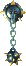
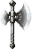
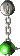

# Summary
| Name | Seal | Atk | Slot | Buy | Sell | Phrase | Info |
|-|-|-|-|-|-|-|-|
|[Wooden Sword](#wooden-sword)|-|2|1|3000|1500|-|Found with +4 ~ +8 upgrade value.|
|[Club](#club)|-|3|3|400|200|KIRARA|-|
|[Nagamaki](#nagamaki)|-|6|4|700|300|SHIREN|-|
|[Sacred Sword](#sacred-sword)|-|8|14|45000|20000|-|-|
|[Katana](#katana)|-|10|5|900|400|SENSEI|-|
|[Dotanuki](#dotanuki)|-|12|6|3600|1200|-|-|
|[Ivory Sword](#ivory-sword)|-|13|4|4000|1600|-|Rustproof.|
|[Kabura's Blade](#kabura's-blade)|-|18|5|15000|7000|SHARK|-|
|[Daisangen Sword](#daisangen-sword)|-|20|9|48000|32000|-|Rustproof. Synthesize 3 中 seals onto an Ivory Sword.|
|[Fiery Fuuma](#fiery-fuuma)|-|30|10|20000|10000|-|Katana+99 with 5 seals → Blacksmith.|
|[Mijinha](#mijinha)|-|50|16|60000|40000|-|-|
|[Kaburasutegi](#kaburasutegi)|-|99|12|55000|20000|-|Kabura's Blade (月, 火, 水, 木, 金) → Blacksmith.|
|[Ghost Sickle](#ghost-sickle)|仏|5|5|5000|2000|-|Deals x1.5 damage to Ghost types.|
|[Drain Buster](#drain-buster)|ド|6|5|5000|2500|-|Deals x1.5 damage to Drain types.|
|[Cyclops Killer](#cyclops-killer)|目|9|4|4500|2000|-|Deals x1.5 damage to Cyclops types.|
|[Crescent Arm](#crescent-arm)|月|14|6|50000|25000|-|Deals x1.5 damage to Bomb types.|
|[Dragon Killer](#dragon-killer)|竜|15|7|10000|5000|-|Deals x1.5 damage to Dragon types.|
|[Ryujin Sword](#ryujin-sword)|龍|25|7|30000|15000|-|Deals x2.0 damage to Dragon types. Synthesize 3 竜 seals onto a Dragon Killer.|
|[Froggo Whip](#froggo-whip)|銭|2|4|16000|8000|-|30% chance to turn defeated monsters into Gitan.|
|[Pickaxe](#pickaxe)|掘|2|5|3500|1600|KAMBE|Dig through walls. Breaks after digging for a while.|
|[Gobo](#gobo)|食|3|2|500|250|-|Can be eaten to restore fullness by 20%. Lost if eaten.|
|[Homing Blade](#homing-blade)|必|3|3|10000|5000|RELIX|Raises attack accuracy to 100%.|
|[Onigiri Sword](#onigiri-sword)|に|3|4|10000|5000|-|8% chance to turn defeated monsters into onigiri.|
|[Golden Sword](#golden-sword)|金|3|5|6000|3000|-|Rustproof. (Blue seal)|
|[Dried Bonito](#dried-bonito)|か|4|2|2000|1000|TORNEKO|Bite to restore 30% fullness, but -1 upgrade value.|
|[Fish Spear](#fish-spear)|水|4|5|4000|1600|RUTO|Lets you hit underwater monsters.|
|[Razor Wind](#razor-wind)|三|5|4|5000|2500|POE|Lets you attack in a 3-way pattern.|
|[Healing Sword](#healing-sword)|回|6|3|20000|10000|-|Restore HP equal to 1/3 of damage dealt.|
|[Kengo's Katana](#kengo's-katana)|ケ|7|4|3200|900|-|Chance to disarm a weapon when attacking enemy.|
|[Spark Sword](#spark-sword)|ス|7|6|15000|7500|-|Guarantees a critical hit after missing 2 attacks.|
|[Wonder Pick](#wonder-pick)|サ|13|4|20000|10000|-|Dig through walls. Will never break.|
|[Disposable Sword](#disposable-sword)|捨|35|3|3000|1500|-|Decrease upgrade value by 1 when you deal damage.|
|[Mallet](#mallet)|木|3|5|4000|2000|MURADO|Two-handed. Breaks traps. Can break.|
|[Power Pole](#power-pole)|-|5|4|20000|10000|-|Two-handed. Retreat 1 tile after hitting enemy or wall.|
|[Iron Hammer](#iron-hammer)|鉄|5|5|20000|10000|-|Two-handed. Breaks traps. Will never break.|
|[Morning Star](#morning-star)|-|5|6|5000|2500|-|Two-handed. Lets you attack in a 1 tile radius.|
|[Spear](#spear)|-|6|7|10000|4000|TINA|Two-handed. Piercing attack 2 tiles forward.|
|[Minotaur's Axe](#minotaur's-axe)|会|8|11|6000|2400|-|Two-handed. 35% chance to deal a critical hit.|
|[Ironhead's Head](#ironhead's-head)|-|9|7|5000|2500|-|Two-handed. Attack a target up to 3 tiles forward.|

# Details

Locations Key:

|Location|Info|
|-|-|
|Floor|Found on the floor inside the dungeon.|
|Presto|Obtained from a Presto Pot.|
|Surprise|Obtained from a Surprise Pot.|
|Shop|Sold as merchandise inside a dungeon shop.|
|Trader|Sold as merchandise by Traders.|
|Monster|Dropped by certain monsters.|
|Golden|Found on the floor inside a Golden Interval.|
|Treasure|Obtained from a treasure chest in a Golden Interval.|

### Wooden Sword

<table>
  <tr>
    <th>Image</th>
    <th>In-game Description</th>
  </tr>
  <tr>
    <td class="itemPageImage">
      
    </td>
    <td>Sword made of wood. Upgraded and passed down through the years by various wanderers.</td>
  </tr>
</table>

Low attack, but comes with an upgrade value ranging from +4 to +8. 
It's never found cursed. Use it as synthesis fodder to strengthen a stronger weapon.

|Seal|Atk|Slots|Buy|Sell|+1|Stack|Phrase|
|-|-|-|-|-|-|-|-|
|-|2|1|3000|1500|300|-|-|

Locations:

<table>
  <tr>
    <th>Small Valley</th>
    <td>-</td>
    <th>Hidden Hole</th>
    <td>-</td>
  </tr>
  <tr>
    <th>Shuten Easy</th>
    <td>-</td>
    <th>Halfway Well</th>
    <td>-</td>
  </tr>
  <tr>
    <th>Shuten Mid</th>
    <td>-</td>
    <th>Sealed Room</th>
    <td>-</td>
  </tr>
  <tr>
    <th>Shuten Hard</th>
    <td>-</td>
    <th>Road to the End</th>
    <td>-</td>
  </tr>
  <tr>
    <th>Onigashima</th>
    <td>Trader</td>
  </tr>
</table>

### Club

<table>
  <tr>
    <th>Image</th>
    <th>In-game Description</th>
  </tr>
  <tr>
    <td class="itemPageImage">
      
    </td>
    <td>Club made of hard wood. One end was carved to make it easier to wield.</td>
  </tr>
</table>

Said to be the weakest weapon. 
However, it has 3 slots so it can be used as a base when making a Healing Sword. 
Ally Iai or Shihan will always fling a Club in dungeons where weapons normally do not appear.

|Seal|Atk|Slots|Buy|Sell|+1|Stack|Phrase|
|-|-|-|-|-|-|-|-|
|-|3|3|400|200|20|-|KIRARA|

Locations:

<table>
  <tr>
    <th>Small Valley</th>
    <td>Floor</td>
    <th>Hidden Hole</th>
    <td>-</td>
  </tr>
  <tr>
    <th>Shuten Easy</th>
    <td>Floor</td>
    <th>Halfway Well</th>
    <td>-</td>
  </tr>
  <tr>
    <th>Shuten Mid</th>
    <td>Floor, Trader</td>
    <th>Sealed Room</th>
    <td>Presto</td>
  </tr>
  <tr>
    <th>Shuten Hard</th>
    <td>Trader</td>
    <th>Road to the End</th>
    <td>Floor, Presto</td>
  </tr>
  <tr>
    <th>Onigashima</th>
    <td>Floor</td>
  </tr>
</table>

### Nagamaki

<table>
  <tr>
    <th>Image</th>
    <th>In-game Description</th>
  </tr>
  <tr>
    <td class="itemPageImage">
      
    </td>
    <td>Weapon that looks like a shortened Naginata.</td>
  </tr>
</table>

Stronger than a Club, but it's still pretty weak. 
It's often used as a base when making a Healing Sword.

|Seal|Atk|Slots|Buy|Sell|+1|Stack|Phrase|
|-|-|-|-|-|-|-|-|
|-|6|4|700|300|35|-|SHIREN|

Locations:

<table>
  <tr>
    <th>Small Valley</th>
    <td>-</td>
    <th>Hidden Hole</th>
    <td>-</td>
  </tr>
  <tr>
    <th>Shuten Easy</th>
    <td>Floor</td>
    <th>Halfway Well</th>
    <td>-</td>
  </tr>
  <tr>
    <th>Shuten Mid</th>
    <td>Floor, Trader</td>
    <th>Sealed Room</th>
    <td>Presto</td>
  </tr>
  <tr>
    <th>Shuten Hard</th>
    <td>Floor, Presto, Shop, Trader</td>
    <th>Road to the End</th>
    <td>Floor, Presto</td>
  </tr>
  <tr>
    <th>Onigashima</th>
    <td>Floor</td>
  </tr>
</table>

### Sacred Sword

<table>
  <tr>
    <th>Image</th>
    <th>In-game Description</th>
  </tr>
  <tr>
    <td class="itemPageImage">
      
    </td>
    <td>This sword lacks innate abilities, but has many synthesis slots.</td>
  </tr>
</table>

Has the second highest number of synthesis slots. 
Popular as a secondary weapon with stacked effects. (examples: 飯, 火, or 幸) 
Useful as a seal container to free up storage space while preparing a Mijinha or Kaburasutegi.

|Seal|Atk|Slots|Buy|Sell|+1|Stack|Phrase|
|-|-|-|-|-|-|-|-|
|-|8|14|45000|20000|2250|-|-|

Locations:

<table>
  <tr>
    <th>Small Valley</th>
    <td>-</td>
    <th>Hidden Hole</th>
    <td>-</td>
  </tr>
  <tr>
    <th>Shuten Easy</th>
    <td>-</td>
    <th>Halfway Well</th>
    <td>-</td>
  </tr>
  <tr>
    <th>Shuten Mid</th>
    <td>-</td>
    <th>Sealed Room</th>
    <td>Golden</td>
  </tr>
  <tr>
    <th>Shuten Hard</th>
    <td>-</td>
    <th>Road to the End</th>
    <td>-</td>
  </tr>
  <tr>
    <th>Onigashima</th>
    <td>-</td>
  </tr>
</table>

### Katana

<table>
  <tr>
    <th>Image</th>
    <th>In-game Description</th>
  </tr>
  <tr>
    <td class="itemPageImage">
      
    </td>
    <td>Popular sword among wanderers.</td>
  </tr>
</table>

It has decent attack and 5 slots, so it can be used as a main weapon. 
However, it's still on the weaker side for post-game dungeons. 
Can be used as a base for making a Healing Sword, or as a secondary weapon with stacked seals. 
Take a Katana+99 with 5 seals to the blacksmith to transform it into a Fiery Fuuma.

|Seal|Atk|Slots|Buy|Sell|+1|Stack|Phrase|
|-|-|-|-|-|-|-|-|
|-|10|5|900|400|45|-|SENSEI|

Locations:

<table>
  <tr>
    <th>Small Valley</th>
    <td>-</td>
    <th>Hidden Hole</th>
    <td>-</td>
  </tr>
  <tr>
    <th>Shuten Easy</th>
    <td>Floor, Presto</td>
    <th>Halfway Well</th>
    <td>-</td>
  </tr>
  <tr>
    <th>Shuten Mid</th>
    <td>Floor, Presto, Shop, Trader</td>
    <th>Sealed Room</th>
    <td>Presto</td>
  </tr>
  <tr>
    <th>Shuten Hard</th>
    <td>Floor, Presto, Shop, Trader, Golden</td>
    <th>Road to the End</th>
    <td>Floor, Presto</td>
  </tr>
  <tr>
    <th>Onigashima</th>
    <td>Floor</td>
  </tr>
</table>

### Dotanuki

<table>
  <tr>
    <th>Image</th>
    <th>In-game Description</th>
  </tr>
  <tr>
    <td class="itemPageImage">
      
    </td>
    <td>Powerful sword made by swordsmith Dotanuki-Genma. It's thicker than a Katana's blade.</td>
  </tr>
</table>

Very popular as a base weapon. However, it's quite rare before post-game dungeons. 
Can be obtained from Surprise Pots found on 15F of Shuten Trail Hard, or from a Trader in Onigashima.

|Seal|Atk|Slots|Buy|Sell|+1|Stack|Phrase|
|-|-|-|-|-|-|-|-|
|-|12|6|3600|1200|180|-|-|

Locations:

<table>
  <tr>
    <th>Small Valley</th>
    <td>-</td>
    <th>Hidden Hole</th>
    <td>-</td>
  </tr>
  <tr>
    <th>Shuten Easy</th>
    <td>-</td>
    <th>Halfway Well</th>
    <td>-</td>
  </tr>
  <tr>
    <th>Shuten Mid</th>
    <td>-</td>
    <th>Sealed Room</th>
    <td>Presto</td>
  </tr>
  <tr>
    <th>Shuten Hard</th>
    <td>Surprise</td>
    <th>Road to the End</th>
    <td>Floor, Presto</td>
  </tr>
  <tr>
    <th>Onigashima</th>
    <td>Trader</td>
  </tr>
</table>

### Ivory Sword

<table>
  <tr>
    <th>Image</th>
    <th>In-game Description</th>
  </tr>
  <tr>
    <td class="itemPageImage">
      
    </td>
    <td>Rustproof sword made of ivory. The rustproof attribute won't transfer if used as a secondary item in synthesis.</td>
  </tr>
</table>

Sword made of Ivory. Rustproof. 
Transforms into Daisangen Sword with 3 中 seals. 
The rustproof ability won't transfer if used as synthesis fodder.

|Seal|Atk|Slots|Buy|Sell|+1|Stack|Phrase|
|-|-|-|-|-|-|-|-|
|-|13|4|4000|1600|200|-|-|

Locations:

<table>
  <tr>
    <th>Small Valley</th>
    <td>-</td>
    <th>Hidden Hole</th>
    <td>-</td>
  </tr>
  <tr>
    <th>Shuten Easy</th>
    <td>-</td>
    <th>Halfway Well</th>
    <td>-</td>
  </tr>
  <tr>
    <th>Shuten Mid</th>
    <td>-</td>
    <th>Sealed Room</th>
    <td>Presto</td>
  </tr>
  <tr>
    <th>Shuten Hard</th>
    <td>-</td>
    <th>Road to the End</th>
    <td>Floor, Presto, Golden</td>
  </tr>
  <tr>
    <th>Onigashima</th>
    <td>Golden</td>
  </tr>
</table>

### Kabura's Blade

<table>
  <tr>
    <th>Image</th>
    <th>In-game Description</th>
  </tr>
  <tr>
    <td class="itemPageImage">
      
    </td>
    <td>Strong sword made by legendary swordsmith Kabura. It's rumored to be the best katana among wanderers. You absolutely don't want to let go of this weapon.</td>
  </tr>
</table>

High attack, but 1 less slot than Dotanuki. 
Bring a Kabura's Blade with 月, 火, 水, 木, and 金 seals (in that order) to the blacksmith to turn it into a Kaburasutegi.

|Seal|Atk|Slots|Buy|Sell|+1|Stack|Phrase|
|-|-|-|-|-|-|-|-|
|-|18|5|15000|7000|2250|-|SHARK|

Locations:

<table>
  <tr>
    <th>Small Valley</th>
    <td>-</td>
    <th>Hidden Hole</th>
    <td>-</td>
  </tr>
  <tr>
    <th>Shuten Easy</th>
    <td>-</td>
    <th>Halfway Well</th>
    <td>-</td>
  </tr>
  <tr>
    <th>Shuten Mid</th>
    <td>-</td>
    <th>Sealed Room</th>
    <td>Presto</td>
  </tr>
  <tr>
    <th>Shuten Hard</th>
    <td>-</td>
    <th>Road to the End</th>
    <td>Presto, Golden</td>
  </tr>
  <tr>
    <th>Onigashima</th>
    <td>Presto</td>
  </tr>
</table>

### Daisangen Sword

<table>
  <tr>
    <th>Image</th>
    <th>In-game Description</th>
  </tr>
  <tr>
    <td class="itemPageImage">
      
    </td>
    <td>Sword spoken of in legends from over 3000 years ago. Rustproof and high attack. It can only be used as a base in synthesis.</td>
  </tr>
</table>

Created by synthesizing 3 中 seals onto an Ivory Sword. Rustproof. 
Difficult to make due to the rarity of Dragon Tile Bracelets. 
Cannot be used as synthesis fodder, or as a base for Healing Sword.

|Seal|Atk|Slots|Buy|Sell|+1|Stack|Phrase|
|-|-|-|-|-|-|-|-|
|-|20|9|48000|32000|4800|-|-|

Locations:

<table>
  <tr>
    <th>Small Valley</th>
    <td>-</td>
    <th>Hidden Hole</th>
    <td>-</td>
  </tr>
  <tr>
    <th>Shuten Easy</th>
    <td>-</td>
    <th>Halfway Well</th>
    <td>-</td>
  </tr>
  <tr>
    <th>Shuten Mid</th>
    <td>-</td>
    <th>Sealed Room</th>
    <td>-</td>
  </tr>
  <tr>
    <th>Shuten Hard</th>
    <td>-</td>
    <th>Road to the End</th>
    <td>-</td>
  </tr>
  <tr>
    <th>Onigashima</th>
    <td>-</td>
  </tr>
</table>

### Fiery Fuuma

<table>
  <tr>
    <th>Image</th>
    <th>In-game Description</th>
  </tr>
  <tr>
    <td class="itemPageImage">
      
    </td>
    <td>Legendary sword cherished by all wanderers in the world.</td>
  </tr>
</table>

3rd strongest sword in the game. 
Obtained by bringing a Katana+99 with 5 seals to the blacksmith. 
It's weaker than a Katana+99 right after transforming, and alternatives like Ryujin Sword 
are pretty close in power and are easier to make, so it's more for collectors.

|Seal|Atk|Slots|Buy|Sell|+1|Stack|Phrase|
|-|-|-|-|-|-|-|-|
|-|30|10|20000|10000|2000|-|-|

Locations:

<table>
  <tr>
    <th>Small Valley</th>
    <td>-</td>
    <th>Hidden Hole</th>
    <td>-</td>
  </tr>
  <tr>
    <th>Shuten Easy</th>
    <td>-</td>
    <th>Halfway Well</th>
    <td>-</td>
  </tr>
  <tr>
    <th>Shuten Mid</th>
    <td>-</td>
    <th>Sealed Room</th>
    <td>-</td>
  </tr>
  <tr>
    <th>Shuten Hard</th>
    <td>-</td>
    <th>Road to the End</th>
    <td>-</td>
  </tr>
  <tr>
    <th>Onigashima</th>
    <td>-</td>
  </tr>
</table>

### Mijinha

<table>
  <tr>
    <th>Image</th>
    <th>In-game Description</th>
  </tr>
  <tr>
    <td class="itemPageImage">
      
    </td>
    <td>Treasured sword of myth. The sword is said to host 16 gods, and has the power to crush the Earth and slice open heaven.</td>
  </tr>
</table>

Legendary sword exclusive to Shiren 2, and it's the 2nd strongest sword in the game. 
Has the highest number of slots among all weapons. 
Obtained from 90-95F golden interval treasure chests inside the "Road to the End" dungeon.

|Seal|Atk|Slots|Buy|Sell|+1|Stack|Phrase|
|-|-|-|-|-|-|-|-|
|-|50|16|60000|40000|12000|-|-|

Locations:

<table>
  <tr>
    <th>Small Valley</th>
    <td>-</td>
    <th>Hidden Hole</th>
    <td>-</td>
  </tr>
  <tr>
    <th>Shuten Easy</th>
    <td>-</td>
    <th>Halfway Well</th>
    <td>-</td>
  </tr>
  <tr>
    <th>Shuten Mid</th>
    <td>-</td>
    <th>Sealed Room</th>
    <td>-</td>
  </tr>
  <tr>
    <th>Shuten Hard</th>
    <td>-</td>
    <th>Road to the End</th>
    <td>Treasure</td>
  </tr>
  <tr>
    <th>Onigashima</th>
    <td>-</td>
  </tr>
</table>

### Kaburasutegi

<table>
  <tr>
    <th>Image</th>
    <th>In-game Description</th>
  </tr>
  <tr>
    <td class="itemPageImage">
      
    </td>
    <td>Final form of Kabura's Blade. Mythical sword largely defined by its secrecy. It's said that not even the legendary swordsmith Kabura could make it consistently. Few wanderers know of it.</td>
  </tr>
</table>

Strongest sword in the game. 
Obtained by bringing a Kabura's Blade with 月, 火, 水, 木, and 金 seals (in that order) to the blacksmith. The 火 seal can be from either Flame Grass or Dragon Grass.

|Seal|Atk|Slots|Buy|Sell|+1|Stack|Phrase|
|-|-|-|-|-|-|-|-|
|-|99|12|55000|20000|8250|-|-|

Locations:

<table>
  <tr>
    <th>Small Valley</th>
    <td>-</td>
    <th>Hidden Hole</th>
    <td>-</td>
  </tr>
  <tr>
    <th>Shuten Easy</th>
    <td>-</td>
    <th>Halfway Well</th>
    <td>-</td>
  </tr>
  <tr>
    <th>Shuten Mid</th>
    <td>-</td>
    <th>Sealed Room</th>
    <td>-</td>
  </tr>
  <tr>
    <th>Shuten Hard</th>
    <td>-</td>
    <th>Road to the End</th>
    <td>-</td>
  </tr>
  <tr>
    <th>Onigashima</th>
    <td>-</td>
  </tr>
</table>

### Ghost Sickle

<table>
  <tr>
    <th>Image</th>
    <th>In-game Description</th>
  </tr>
  <tr>
    <td class="itemPageImage">
      
    </td>
    <td>Increases damage dealt to ghost type monsters like Pumphantasm.</td>
  </tr>
</table>

Weapon that deals x1.5 damage to Ghost type monsters. 
(Gale, Pumphantasm, Yamikichi, and Bone Dragon families) 
Great seal to have in dungeons where Typhoon appears.

|Seal|Atk|Slots|Buy|Sell|+1|Stack|Phrase|
|-|-|-|-|-|-|-|-|
|仏|5|5|5000|2000|250|Yes|-|

Stacked Effect:

<table>
  <tr>
    <th>Seals</th>
    <th></th>
    <th>1</th>
    <th>2</th>
    <th>3</th>
    <th>4</th>
    <th>5</th>
    <th>6</th>
    <th>7</th>
    <th>8</th>
  </tr>
  <tr>
    <th></th>
    <th>9</th>
    <th>10</th>
    <th>11</th>
    <th>12</th>
    <th>13</th>
    <th>14</th>
    <th>15</th>
    <th>16</th>
    <th>17</th>
  </tr>
  <tr>
    <td>Damage (%)</td>
    <td></td>
    <td>150</td>
    <td>160</td>
    <td>170</td>
    <td>180</td>
    <td>190</td>
    <td>200</td>
    <td>240</td>
    <td>270</td>
  </tr>
  <tr>
    <td></td>
    <td>300</td>
    <td>350</td>
    <td>400</td>
    <td>450</td>
    <td>500</td>
    <td>550</td>
    <td>600</td>
    <td>650</td>
    <td>700</td>
  </tr>
</table>

Locations:

<table>
  <tr>
    <th>Small Valley</th>
    <td>-</td>
    <th>Hidden Hole</th>
    <td>-</td>
  </tr>
  <tr>
    <th>Shuten Easy</th>
    <td>Presto</td>
    <th>Halfway Well</th>
    <td>-</td>
  </tr>
  <tr>
    <th>Shuten Mid</th>
    <td>Presto</td>
    <th>Sealed Room</th>
    <td>Presto</td>
  </tr>
  <tr>
    <th>Shuten Hard</th>
    <td>Floor, Presto, Golden</td>
    <th>Road to the End</th>
    <td>Floor, Presto, Surprise, Shop, Trader</td>
  </tr>
  <tr>
    <th>Onigashima</th>
    <td>Presto, Surprise, Shop, Trader</td>
  </tr>
</table>

### Drain Buster

<table>
  <tr>
    <th>Image</th>
    <th>In-game Description</th>
  </tr>
  <tr>
    <td class="itemPageImage">
      
    </td>
    <td>Increases damage dealt to monsters that lower your stats like Twisty Hani.</td>
  </tr>
</table>

Weapon that deals x1.5 damage to Drain type monsters. 
(Sluggy, Scorpion, Hunger Puppet families, and Twisty Hani) 
Nice seal to have, since the special attacks of Drain type monsters can be quite bothersome.

|Seal|Atk|Slots|Buy|Sell|+1|Stack|Phrase|
|-|-|-|-|-|-|-|-|
|ド|6|5|5000|2500|250|Yes|-|

Stacked Effect:

<table>
  <tr>
    <th>Seals</th>
    <th></th>
    <th>1</th>
    <th>2</th>
    <th>3</th>
    <th>4</th>
    <th>5</th>
    <th>6</th>
    <th>7</th>
    <th>8</th>
  </tr>
  <tr>
    <th></th>
    <th>9</th>
    <th>10</th>
    <th>11</th>
    <th>12</th>
    <th>13</th>
    <th>14</th>
    <th>15</th>
    <th>16</th>
    <th>17</th>
  </tr>
  <tr>
    <td>Damage (%)</td>
    <td></td>
    <td>150</td>
    <td>160</td>
    <td>170</td>
    <td>180</td>
    <td>190</td>
    <td>200</td>
    <td>240</td>
    <td>270</td>
  </tr>
  <tr>
    <td></td>
    <td>300</td>
    <td>500</td>
    <td>500</td>
    <td>500</td>
    <td>500</td>
    <td>500</td>
    <td>500</td>
    <td>500</td>
    <td>500</td>
  </tr>
</table>

Locations:

<table>
  <tr>
    <th>Small Valley</th>
    <td>-</td>
    <th>Hidden Hole</th>
    <td>-</td>
  </tr>
  <tr>
    <th>Shuten Easy</th>
    <td>-</td>
    <th>Halfway Well</th>
    <td>-</td>
  </tr>
  <tr>
    <th>Shuten Mid</th>
    <td>Presto</td>
    <th>Sealed Room</th>
    <td>Presto</td>
  </tr>
  <tr>
    <th>Shuten Hard</th>
    <td>Golden</td>
    <th>Road to the End</th>
    <td>Floor, Presto, Surprise, Shop, Trader</td>
  </tr>
  <tr>
    <th>Onigashima</th>
    <td>Presto, Surprise, Shop, Trader</td>
  </tr>
</table>

### Cyclops Killer

<table>
  <tr>
    <th>Image</th>
    <th>In-game Description</th>
  </tr>
  <tr>
    <td class="itemPageImage">
      
    </td>
    <td>Increases damage dealt to one-eyed monsters like Gazer.</td>
  </tr>
</table>

Weapon that deals x1.5 damage to One-eyed monsters. 
(Ironhead, Golem, and Gazer families) 
Gazer's hypnosis can be nullified with an Echo Shield, so this seal isn't very necessary.

|Seal|Atk|Slots|Buy|Sell|+1|Stack|Phrase|
|-|-|-|-|-|-|-|-|
|目|9|4|4500|2000|225|Yes|-|

Stacked Effect:

<table>
  <tr>
    <th>Seals</th>
    <th></th>
    <th>1</th>
    <th>2</th>
    <th>3</th>
    <th>4</th>
    <th>5</th>
    <th>6</th>
    <th>7</th>
    <th>8</th>
  </tr>
  <tr>
    <th></th>
    <th>9</th>
    <th>10</th>
    <th>11</th>
    <th>12</th>
    <th>13</th>
    <th>14</th>
    <th>15</th>
    <th>16</th>
    <th>17</th>
  </tr>
  <tr>
    <td>Damage (%)</td>
    <td></td>
    <td>150</td>
    <td>160</td>
    <td>170</td>
    <td>180</td>
    <td>190</td>
    <td>200</td>
    <td>240</td>
    <td>270</td>
  </tr>
  <tr>
    <td></td>
    <td>300</td>
    <td>350</td>
    <td>400</td>
    <td>450</td>
    <td>500</td>
    <td>550</td>
    <td>600</td>
    <td>650</td>
    <td>700</td>
  </tr>
</table>

Locations:

<table>
  <tr>
    <th>Small Valley</th>
    <td>-</td>
    <th>Hidden Hole</th>
    <td>-</td>
  </tr>
  <tr>
    <th>Shuten Easy</th>
    <td>Presto</td>
    <th>Halfway Well</th>
    <td>-</td>
  </tr>
  <tr>
    <th>Shuten Mid</th>
    <td>Presto</td>
    <th>Sealed Room</th>
    <td>Presto</td>
  </tr>
  <tr>
    <th>Shuten Hard</th>
    <td>Floor, Presto, Golden</td>
    <th>Road to the End</th>
    <td>Floor, Presto, Surprise, Shop, Trader</td>
  </tr>
  <tr>
    <th>Onigashima</th>
    <td>Presto, Surprise, Shop, Trader</td>
  </tr>
</table>

### Crescent Arm

<table>
  <tr>
    <th>Image</th>
    <th>In-game Description</th>
  </tr>
  <tr>
    <td class="itemPageImage">
      
    </td>
    <td>Increases damage dealt to bomb type monsters such as Pop Tank.</td>
  </tr>
</table>

Weapon that deals x1.5 damage to Bomb type monsters. 
(Wolf Droid family, Pop Tank, Cranky Tank, and Patient Bag) 
Obtained each time you defeat Boss Oni in Onigashima after finishing the main story.

|Seal|Atk|Slots|Buy|Sell|+1|Stack|Phrase|
|-|-|-|-|-|-|-|-|
|月|14|6|50000|25000|5000|Yes|-|

Stacked Effect:

<table>
  <tr>
    <th>Seals</th>
    <th></th>
    <th>1</th>
    <th>2</th>
    <th>3</th>
    <th>4</th>
    <th>5</th>
    <th>6</th>
    <th>7</th>
    <th>8</th>
  </tr>
  <tr>
    <th></th>
    <th>9</th>
    <th>10</th>
    <th>11</th>
    <th>12</th>
    <th>13</th>
    <th>14</th>
    <th>15</th>
    <th>16</th>
    <th>17</th>
  </tr>
  <tr>
    <td>Damage (%)</td>
    <td></td>
    <td>150</td>
    <td>160</td>
    <td>170</td>
    <td>180</td>
    <td>190</td>
    <td>200</td>
    <td>240</td>
    <td>270</td>
  </tr>
  <tr>
    <td></td>
    <td>300</td>
    <td>350</td>
    <td>400</td>
    <td>450</td>
    <td>500</td>
    <td>550</td>
    <td>600</td>
    <td>650</td>
    <td>700</td>
  </tr>
</table>

Locations:

<table>
  <tr>
    <th>Small Valley</th>
    <td>-</td>
    <th>Hidden Hole</th>
    <td>-</td>
  </tr>
  <tr>
    <th>Shuten Easy</th>
    <td>-</td>
    <th>Halfway Well</th>
    <td>-</td>
  </tr>
  <tr>
    <th>Shuten Mid</th>
    <td>-</td>
    <th>Sealed Room</th>
    <td>-</td>
  </tr>
  <tr>
    <th>Shuten Hard</th>
    <td>-</td>
    <th>Road to the End</th>
    <td>-</td>
  </tr>
  <tr>
    <th>Onigashima</th>
    <td>-</td>
  </tr>
</table>

### Dragon Killer

<table>
  <tr>
    <th>Image</th>
    <th>In-game Description</th>
  </tr>
  <tr>
    <td class="itemPageImage">
      
    </td>
    <td>Increases damage dealt to dragon type monsters like Shagga.</td>
  </tr>
</table>

Weapon that deals x1.5 damage to Dragon type monsters. 
(Shaaga, Aqua Dragon, Shotfish, Dragon, and Bone Dragon families) 
Synthesize 3 竜 seals onto it to transform it into a Ryujin Sword. 
Excellent as a main weapon.

|Seal|Atk|Slots|Buy|Sell|+1|Stack|Phrase|
|-|-|-|-|-|-|-|-|
|竜|15|7|10000|5000|500|Yes|-|

Stacked Effect:

<table>
  <tr>
    <th>Seals</th>
    <th>1</th>
    <th>2</th>
    <th>3</th>
    <th>4</th>
    <th>5</th>
    <th>6</th>
    <th>7</th>
    <th>8</th>
  </tr>
  <tr>
    <th></th>
    <th>9</th>
    <th>10</th>
    <th>11</th>
    <th>12</th>
    <th>13</th>
    <th>14</th>
    <th>15</th>
    <th>16</th>
  </tr>
  <tr>
    <td>Damage (%)</td>
    <td>150</td>
    <td>160</td>
    <td>170</td>
    <td>180</td>
    <td>190</td>
    <td>200</td>
    <td>240</td>
    <td>270</td>
  </tr>
  <tr>
    <td></td>
    <td>300</td>
    <td>350</td>
    <td>400</td>
    <td>450</td>
    <td>500</td>
    <td>550</td>
    <td>600</td>
    <td>650</td>
  </tr>
</table>

Locations:

<table>
  <tr>
    <th>Small Valley</th>
    <td>-</td>
    <th>Hidden Hole</th>
    <td>-</td>
  </tr>
  <tr>
    <th>Shuten Easy</th>
    <td>-</td>
    <th>Halfway Well</th>
    <td>-</td>
  </tr>
  <tr>
    <th>Shuten Mid</th>
    <td>-</td>
    <th>Sealed Room</th>
    <td>-</td>
  </tr>
  <tr>
    <th>Shuten Hard</th>
    <td>-</td>
    <th>Road to the End</th>
    <td>Golden</td>
  </tr>
  <tr>
    <th>Onigashima</th>
    <td>Golden</td>
  </tr>
</table>

### Ryujin Sword

<table>
  <tr>
    <th>Image</th>
    <th>In-game Description</th>
  </tr>
  <tr>
    <td class="itemPageImage">
      
    </td>
    <td>Deals massive damage to dragon type monsters.</td>
  </tr>
</table>

Powerful weapon created by synthesizing 3 竜 seals onto a Dragon Killer. 
Deals x2.0 damage to Dragon type monsters. 
(Shaaga, Aqua Dragon, Shotfish, Dragon, and Bone Dragon families) 
Often used as a main weapon while working towards Mijinha or Kaburasutegi. 
Cannot be used as a base for Healing Sword.

|Seal|Atk|Slots|Buy|Sell|+1|Stack|Phrase|
|-|-|-|-|-|-|-|-|
|龍|25|7|30000|15000|3000|Yes|-|

Stacked Effect:

<table>
  <tr>
    <th>Seals</th>
    <th></th>
    <th>1</th>
    <th>2</th>
    <th>3</th>
    <th>4</th>
    <th>5</th>
    <th>6</th>
    <th>7</th>
    <th>8</th>
  </tr>
  <tr>
    <th></th>
    <th>9</th>
    <th>10</th>
    <th>11</th>
    <th>12</th>
    <th>13</th>
    <th>14</th>
    <th>15</th>
    <th>16</th>
    <th>17</th>
  </tr>
  <tr>
    <td>Damage (%)</td>
    <td></td>
    <td>200</td>
    <td>220</td>
    <td>250</td>
    <td>270</td>
    <td>300</td>
    <td>350</td>
    <td>400</td>
    <td>500</td>
  </tr>
  <tr>
    <td></td>
    <td>550</td>
    <td>600</td>
    <td>600</td>
    <td>600</td>
    <td>600</td>
    <td>600</td>
    <td>600</td>
    <td>600</td>
    <td>600</td>
  </tr>
</table>

Locations:

<table>
  <tr>
    <th>Small Valley</th>
    <td>-</td>
    <th>Hidden Hole</th>
    <td>-</td>
  </tr>
  <tr>
    <th>Shuten Easy</th>
    <td>-</td>
    <th>Halfway Well</th>
    <td>-</td>
  </tr>
  <tr>
    <th>Shuten Mid</th>
    <td>-</td>
    <th>Sealed Room</th>
    <td>-</td>
  </tr>
  <tr>
    <th>Shuten Hard</th>
    <td>-</td>
    <th>Road to the End</th>
    <td>-</td>
  </tr>
  <tr>
    <th>Onigashima</th>
    <td>-</td>
  </tr>
</table>

### Froggo Whip

<table>
  <tr>
    <th>Image</th>
    <th>In-game Description</th>
  </tr>
  <tr>
    <td class="itemPageImage">
      
    </td>
    <td>Whip that hosts the spirit of a Froggo obsessed with Gitan. Enemies occasionally turn into Gitan when defeated.</td>
  </tr>
</table>

Has a 30% chance to transform defeated monsters into Gitan. 
Defeated monsters can still drop other items, such as area drops or onigiri. (飯 seal)

|Seal|Atk|Slots|Buy|Sell|+1|Stack|Phrase|
|-|-|-|-|-|-|-|-|
|銭|2|4|16000|8000|800|Yes|-|

Stacked Effect:

<table>
  <tr>
    <th>Seals</th>
    <th></th>
    <th>1</th>
    <th>2</th>
    <th>3</th>
    <th>4</th>
    <th>5</th>
    <th>6</th>
    <th>7</th>
    <th>8</th>
  </tr>
  <tr>
    <th></th>
    <th>9</th>
    <th>10</th>
    <th>11</th>
    <th>12</th>
    <th>13</th>
    <th>14</th>
    <th>15</th>
    <th>16</th>
    <th>17</th>
  </tr>
  <tr>
    <td>Chance (%)</td>
    <td></td>
    <td>30</td>
    <td>35</td>
    <td>40</td>
    <td>45</td>
    <td>50</td>
    <td>55</td>
    <td>60</td>
    <td>65</td>
  </tr>
  <tr>
    <td></td>
    <td>70</td>
    <td>75</td>
    <td>80</td>
    <td>85</td>
    <td>90</td>
    <td>95</td>
    <td>96</td>
    <td>97</td>
    <td>98</td>
  </tr>
</table>

Locations:

<table>
  <tr>
    <th>Small Valley</th>
    <td>-</td>
    <th>Hidden Hole</th>
    <td>-</td>
  </tr>
  <tr>
    <th>Shuten Easy</th>
    <td>-</td>
    <th>Halfway Well</th>
    <td>-</td>
  </tr>
  <tr>
    <th>Shuten Mid</th>
    <td>-</td>
    <th>Sealed Room</th>
    <td>-</td>
  </tr>
  <tr>
    <th>Shuten Hard</th>
    <td>Treasure</td>
    <th>Road to the End</th>
    <td>-</td>
  </tr>
  <tr>
    <th>Onigashima</th>
    <td>-</td>
  </tr>
</table>

### Pickaxe

<table>
  <tr>
    <th>Image</th>
    <th>In-game Description</th>
  </tr>
  <tr>
    <td class="itemPageImage">
      
    </td>
    <td>Lets you dig through walls. Digging will eventually cause it to break.</td>
  </tr>
</table>

Pickaxe that can be used to dig through walls. 
Breaks after digging for a while. (15 ~ 60 uses) 
Useful for creating paths when stealing from shops, or making shortcuts in general. 
Synthesize 5 堀 seals onto it to transform it into a Wonder Pick.

|Seal|Atk|Slots|Buy|Sell|+1|Stack|Phrase|
|-|-|-|-|-|-|-|-|
|堀|2|5|3500|1600|175|No|KAMBE|

Locations:

<table>
  <tr>
    <th>Small Valley</th>
    <td>-</td>
    <th>Hidden Hole</th>
    <td>-</td>
  </tr>
  <tr>
    <th>Shuten Easy</th>
    <td>-</td>
    <th>Halfway Well</th>
    <td>Floor</td>
  </tr>
  <tr>
    <th>Shuten Mid</th>
    <td>-</td>
    <th>Sealed Room</th>
    <td>Presto</td>
  </tr>
  <tr>
    <th>Shuten Hard</th>
    <td>-</td>
    <th>Road to the End</th>
    <td>Floor, Presto</td>
  </tr>
  <tr>
    <th>Onigashima</th>
    <td>Floor, Presto</td>
  </tr>
</table>

### Gobo

<table>
  <tr>
    <th>Image</th>
    <th>In-game Description</th>
  </tr>
  <tr>
    <td class="itemPageImage">
      
    </td>
    <td>Burdock root used as a weapon. Eating it replenishes fullness by a small amount.</td>
  </tr>
</table>

Can be eaten to restore fullness by 20%. The weapon is lost if eaten.

|Seal|Atk|Slots|Buy|Sell|+1|Stack|Phrase|
|-|-|-|-|-|-|-|-|
|食|3|2|500|250|25|No|-|

Locations:

<table>
  <tr>
    <th>Small Valley</th>
    <td>-</td>
    <th>Hidden Hole</th>
    <td>-</td>
  </tr>
  <tr>
    <th>Shuten Easy</th>
    <td>-</td>
    <th>Halfway Well</th>
    <td>-</td>
  </tr>
  <tr>
    <th>Shuten Mid</th>
    <td>-</td>
    <th>Sealed Room</th>
    <td>Presto</td>
  </tr>
  <tr>
    <th>Shuten Hard</th>
    <td>-</td>
    <th>Road to the End</th>
    <td>Floor, Presto</td>
  </tr>
  <tr>
    <th>Onigashima</th>
    <td>Floor, Presto</td>
  </tr>
</table>

### Homing Blade

<table>
  <tr>
    <th>Image</th>
    <th>In-game Description</th>
  </tr>
  <tr>
    <td class="itemPageImage">
      
    </td>
    <td>Low attack, but your attacks will never miss with this sword.</td>
  </tr>
</table>

Sword that ensures all of your attacks will connect. 
Greatly reduces the amount of danger within an adventure, since it eliminates actions received as a result of missed attacks. 
Some say using it is cheating, and therefore personally ban its usage.

|Seal|Atk|Slots|Buy|Sell|+1|Stack|Phrase|
|-|-|-|-|-|-|-|-|
|必|3|3|10000|5000|500|No|RELIX|

Locations:

<table>
  <tr>
    <th>Small Valley</th>
    <td>-</td>
    <th>Hidden Hole</th>
    <td>-</td>
  </tr>
  <tr>
    <th>Shuten Easy</th>
    <td>-</td>
    <th>Halfway Well</th>
    <td>-</td>
  </tr>
  <tr>
    <th>Shuten Mid</th>
    <td>-</td>
    <th>Sealed Room</th>
    <td>Golden</td>
  </tr>
  <tr>
    <th>Shuten Hard</th>
    <td>-</td>
    <th>Road to the End</th>
    <td>-</td>
  </tr>
  <tr>
    <th>Onigashima</th>
    <td>-</td>
  </tr>
</table>

### Onigiri Sword

<table>
  <tr>
    <th>Image</th>
    <th>In-game Description</th>
  </tr>
  <tr>
    <td class="itemPageImage">
      
    </td>
    <td>Sword that hosts the spirit of a Nigiri Morph who loves onigiri. Enemies occasionally turn into onigiri when defeated.</td>
  </tr>
</table>

Has a 8% chance to transform defeated monsters into onigiri. 
Its effect is more potent than the 飯 seal, and can eliminate hunger issues altogether.

|Seal|Atk|Slots|Buy|Sell|+1|Stack|Phrase|
|-|-|-|-|-|-|-|-|
|に|3|4|10000|5000|500|Yes|-|

Stacked Effect:

<table>
  <tr>
    <th>Seals</th>
    <th></th>
    <th>1</th>
    <th>2</th>
    <th>3</th>
    <th>4</th>
    <th>5</th>
    <th>6</th>
    <th>7</th>
    <th>8</th>
  </tr>
  <tr>
    <th></th>
    <th>9</th>
    <th>10</th>
    <th>11</th>
    <th>12</th>
    <th>13</th>
    <th>14</th>
    <th>15</th>
    <th>16</th>
    <th>17</th>
  </tr>
  <tr>
    <td>Chance (%)</td>
    <td></td>
    <td>8</td>
    <td>12</td>
    <td>24</td>
    <td>36</td>
    <td>48</td>
    <td>60</td>
    <td>65</td>
    <td>70</td>
  </tr>
  <tr>
    <td></td>
    <td>75</td>
    <td>80</td>
    <td>85</td>
    <td>90</td>
    <td>95</td>
    <td>96</td>
    <td>97</td>
    <td>98</td>
    <td>99</td>
  </tr>
</table>

Locations:

<table>
  <tr>
    <th>Small Valley</th>
    <td>-</td>
    <th>Hidden Hole</th>
    <td>-</td>
  </tr>
  <tr>
    <th>Shuten Easy</th>
    <td>-</td>
    <th>Halfway Well</th>
    <td>-</td>
  </tr>
  <tr>
    <th>Shuten Mid</th>
    <td>-</td>
    <th>Sealed Room</th>
    <td>-</td>
  </tr>
  <tr>
    <th>Shuten Hard</th>
    <td>Treasure</td>
    <th>Road to the End</th>
    <td>-</td>
  </tr>
  <tr>
    <th>Onigashima</th>
    <td>-</td>
  </tr>
</table>

### Golden Sword

<table>
  <tr>
    <th>Image</th>
    <th>In-game Description</th>
  </tr>
  <tr>
    <td class="itemPageImage">
      
    </td>
    <td>Soft and not very sharp, but rustproof.</td>
  </tr>
</table>

Sword made out of gold. Low attack, but it will never rust. 
Provides a blue 金 seal when synthesized. Monsoon Dolls will tear off a red 金 seal first, but a blue one has the same odds to be removed as the other seals.

|Seal|Atk|Slots|Buy|Sell|+1|Stack|Phrase|
|-|-|-|-|-|-|-|-|
|金|3|5|6000|3000|300|No|-|

Locations:

<table>
  <tr>
    <th>Small Valley</th>
    <td>-</td>
    <th>Hidden Hole</th>
    <td>-</td>
  </tr>
  <tr>
    <th>Shuten Easy</th>
    <td>-</td>
    <th>Halfway Well</th>
    <td>-</td>
  </tr>
  <tr>
    <th>Shuten Mid</th>
    <td>-</td>
    <th>Sealed Room</th>
    <td>Presto, Treasure</td>
  </tr>
  <tr>
    <th>Shuten Hard</th>
    <td>-</td>
    <th>Road to the End</th>
    <td>Floor, Presto, Treasure</td>
  </tr>
  <tr>
    <th>Onigashima</th>
    <td>Golden, Treasure</td>
  </tr>
</table>

### Dried Bonito

<table>
  <tr>
    <th>Image</th>
    <th>In-game Description</th>
  </tr>
  <tr>
    <td class="itemPageImage">
      
    </td>
    <td>Normally used for making broth. Biting it replenishes fullness by a small amount, but also lowers its strength.</td>
  </tr>
</table>

Can be bitten to restore fullness by 30% at the cost of lowering upgrade value by 1. 
Cannot bite once the weapon's attack is at 0. 
Synthesize it onto a Disposable Sword to create a weapon that can be bitten 35 times. (1050% fullness)

|Seal|Atk|Slots|Buy|Sell|+1|Stack|Phrase|
|-|-|-|-|-|-|-|-|
|か|4|2|2000|1000|100|No|TORNEKO|

Locations:

<table>
  <tr>
    <th>Small Valley</th>
    <td>-</td>
    <th>Hidden Hole</th>
    <td>-</td>
  </tr>
  <tr>
    <th>Shuten Easy</th>
    <td>-</td>
    <th>Halfway Well</th>
    <td>-</td>
  </tr>
  <tr>
    <th>Shuten Mid</th>
    <td>-</td>
    <th>Sealed Room</th>
    <td>Presto</td>
  </tr>
  <tr>
    <th>Shuten Hard</th>
    <td>-</td>
    <th>Road to the End</th>
    <td>Floor, Presto, Shop</td>
  </tr>
  <tr>
    <th>Onigashima</th>
    <td>Floor, Presto, Shop</td>
  </tr>
</table>

### Fish Spear

<table>
  <tr>
    <th>Image</th>
    <th>In-game Description</th>
  </tr>
  <tr>
    <td class="itemPageImage">
      
    </td>
    <td>One-handed spear that can hit underwater monsters. It's said to be the soul of Spearfish.</td>
  </tr>
</table>

Weapon that allows you to hit underwater monsters. 
Useful against monsters such as Shotfish, Spearfish, Orcan, Kappa, and Zalokleft. 
Rare drop from Lv2+ Spearfish monsters.

|Seal|Atk|Slots|Buy|Sell|+1|Stack|Phrase|
|-|-|-|-|-|-|-|-|
|水|4|5|4000|1600|200|No|RUTO|

Locations:

<table>
  <tr>
    <th>Small Valley</th>
    <td>-</td>
    <th>Hidden Hole</th>
    <td>Monster</td>
  </tr>
  <tr>
    <th>Shuten Easy</th>
    <td>-</td>
    <th>Halfway Well</th>
    <td>Monster</td>
  </tr>
  <tr>
    <th>Shuten Mid</th>
    <td>Monster</td>
    <th>Sealed Room</th>
    <td>Monster</td>
  </tr>
  <tr>
    <th>Shuten Hard</th>
    <td>-</td>
    <th>Road to the End</th>
    <td>Shop, Monster</td>
  </tr>
  <tr>
    <th>Onigashima</th>
    <td>Presto, Shop, Monster</td>
  </tr>
</table>

### Razor Wind

<table>
  <tr>
    <th>Image</th>
    <th>In-game Description</th>
  </tr>
  <tr>
    <td class="itemPageImage">
      
    </td>
    <td>A mysterious sword that can attack in a 3-way pattern. Useful for situations such as monster house entrances.</td>
  </tr>
</table>

An enchanted sword that can attack in a 3-way pattern. 
Useful for monster house entrances and attacking around corners. 
Plays well with Healing Sword, along with Scout and Phantasm bracelets.

|Seal|Atk|Slots|Buy|Sell|+1|Stack|Phrase|
|-|-|-|-|-|-|-|-|
|三|5|4|5000|2500|250|No|POE|

Locations:

<table>
  <tr>
    <th>Small Valley</th>
    <td>-</td>
    <th>Hidden Hole</th>
    <td>-</td>
  </tr>
  <tr>
    <th>Shuten Easy</th>
    <td>Floor, Presto</td>
    <th>Halfway Well</th>
    <td>-</td>
  </tr>
  <tr>
    <th>Shuten Mid</th>
    <td>Presto, Shop</td>
    <th>Sealed Room</th>
    <td>Presto</td>
  </tr>
  <tr>
    <th>Shuten Hard</th>
    <td>Floor, Presto, Shop, Golden</td>
    <th>Road to the End</th>
    <td>Floor, Presto, Surprise, Shop, Trader</td>
  </tr>
  <tr>
    <th>Onigashima</th>
    <td>Surprise, Shop, Trader</td>
  </tr>
</table>

### Healing Sword

<table>
  <tr>
    <th>Image</th>
    <th>In-game Description</th>
  </tr>
  <tr>
    <td class="itemPageImage">
      
    </td>
    <td>Restores a small amount of HP when damage is dealt.</td>
  </tr>
</table>

Sword that restores HP equal to 1/3 of the damage dealt, out of the monster's remaining HP. 
Created by synthesizing 薬, 弟, and 命 seals onto a weapon. 
One of the best seals in the game, and synthesizing it should be prioritized.

|Seal|Atk|Slots|Buy|Sell|+1|Stack|Phrase|
|-|-|-|-|-|-|-|-|
|回|6|3|20000|10000|2000|No|-|

Locations:

<table>
  <tr>
    <th>Small Valley</th>
    <td>-</td>
    <th>Hidden Hole</th>
    <td>-</td>
  </tr>
  <tr>
    <th>Shuten Easy</th>
    <td>-</td>
    <th>Halfway Well</th>
    <td>-</td>
  </tr>
  <tr>
    <th>Shuten Mid</th>
    <td>-</td>
    <th>Sealed Room</th>
    <td>-</td>
  </tr>
  <tr>
    <th>Shuten Hard</th>
    <td>-</td>
    <th>Road to the End</th>
    <td>-</td>
  </tr>
  <tr>
    <th>Onigashima</th>
    <td>-</td>
  </tr>
</table>

### Kengo's Katana

<table>
  <tr>
    <th>Image</th>
    <th>In-game Description</th>
  </tr>
  <tr>
    <td class="itemPageImage">
      
    </td>
    <td>This katana hosts he spirit of a Kengo who likes to parry swords. Occasionally disarms the opponent when attacking.</td>
  </tr>
</table>

Sword that can fling a weapon from a monster when attacking. 
Damage is not dealt if disarming occurs, so you'll be vulnerable to a counter attack. 
Can be used to obtain monster-exclusive drops, but the odds remain the same. 
Rare drop from Lv2+ Kengo monsters.

|Seal|Atk|Slots|Buy|Sell|+1|Stack|Phrase|
|-|-|-|-|-|-|-|-|
|ケ|7|4|3200|900|160|No|-|

Locations:

<table>
  <tr>
    <th>Small Valley</th>
    <td>-</td>
    <th>Hidden Hole</th>
    <td>-</td>
  </tr>
  <tr>
    <th>Shuten Easy</th>
    <td>-</td>
    <th>Halfway Well</th>
    <td>Monster</td>
  </tr>
  <tr>
    <th>Shuten Mid</th>
    <td>Monster</td>
    <th>Sealed Room</th>
    <td>Monster</td>
  </tr>
  <tr>
    <th>Shuten Hard</th>
    <td>Monster</td>
    <th>Road to the End</th>
    <td>Monster</td>
  </tr>
  <tr>
    <th>Onigashima</th>
    <td>Monster</td>
  </tr>
</table>

### Spark Sword

<table>
  <tr>
    <th>Image</th>
    <th>In-game Description</th>
  </tr>
  <tr>
    <td class="itemPageImage">
      
    </td>
    <td>A very prideful sword that builds up rage every time you miss. Shines brightly and deals a critical hit after enough buildup.</td>
  </tr>
</table>

Glows after 2 missed attacks, and deals a 100% accuracy critical hit for x1.5 damage on the next attack. 
Overshadowed by 必, but useful in Road to the End where Homing Blade doesn't appear.

|Seal|Atk|Slots|Buy|Sell|+1|Stack|Phrase|
|-|-|-|-|-|-|-|-|
|ス|7|6|15000|7500|750|No|-|

Locations:

<table>
  <tr>
    <th>Small Valley</th>
    <td>-</td>
    <th>Hidden Hole</th>
    <td>-</td>
  </tr>
  <tr>
    <th>Shuten Easy</th>
    <td>-</td>
    <th>Halfway Well</th>
    <td>-</td>
  </tr>
  <tr>
    <th>Shuten Mid</th>
    <td>-</td>
    <th>Sealed Room</th>
    <td>Presto</td>
  </tr>
  <tr>
    <th>Shuten Hard</th>
    <td>Surprise</td>
    <th>Road to the End</th>
    <td>Floor, Presto</td>
  </tr>
  <tr>
    <th>Onigashima</th>
    <td>Presto, Shop</td>
  </tr>
</table>

### Wonder Pick

<table>
  <tr>
    <th>Image</th>
    <th>In-game Description</th>
  </tr>
  <tr>
    <td class="itemPageImage">
      
    </td>
    <td>Oh my! This wondrous pickaxe can be used to dig through walls and will never break.</td>
  </tr>
</table>

Pickaxe that will never break while digging through walls. 
Very useful for stealing and creating shortcuts. 
Plays well with Razor Wind's ability to attack around corners. 
Created by synthesizing 5 堀 seals onto a Pickaxe.

|Seal|Atk|Slots|Buy|Sell|+1|Stack|Phrase|
|-|-|-|-|-|-|-|-|
|サ|13|4|20000|10000|2000|No|-|

Locations:

<table>
  <tr>
    <th>Small Valley</th>
    <td>-</td>
    <th>Hidden Hole</th>
    <td>-</td>
  </tr>
  <tr>
    <th>Shuten Easy</th>
    <td>-</td>
    <th>Halfway Well</th>
    <td>-</td>
  </tr>
  <tr>
    <th>Shuten Mid</th>
    <td>-</td>
    <th>Sealed Room</th>
    <td>-</td>
  </tr>
  <tr>
    <th>Shuten Hard</th>
    <td>-</td>
    <th>Road to the End</th>
    <td>-</td>
  </tr>
  <tr>
    <th>Onigashima</th>
    <td>-</td>
  </tr>
</table>

### Disposable Sword

<table>
  <tr>
    <th>Image</th>
    <th>In-game Description</th>
  </tr>
  <tr>
    <td class="itemPageImage">
      
    </td>
    <td>Starts with very high attack, but degrades after every hit. It's often discarded in the end.</td>
  </tr>
</table>

Starts out with very high attack, but loses 1 upgrade value every time you deal damage. 
Synthesizing the 金 seal onto it won't prevent the loss of upgrade value. 
The か seal can be synthesized onto it to use it as a food source worth 1050% fullness.

|Seal|Atk|Slots|Buy|Sell|+1|Stack|Phrase|
|-|-|-|-|-|-|-|-|
|捨|35|3|3000|1500|150|No|-|

Locations:

<table>
  <tr>
    <th>Small Valley</th>
    <td>-</td>
    <th>Hidden Hole</th>
    <td>-</td>
  </tr>
  <tr>
    <th>Shuten Easy</th>
    <td>-</td>
    <th>Halfway Well</th>
    <td>-</td>
  </tr>
  <tr>
    <th>Shuten Mid</th>
    <td>Presto</td>
    <th>Sealed Room</th>
    <td>Presto</td>
  </tr>
  <tr>
    <th>Shuten Hard</th>
    <td>-</td>
    <th>Road to the End</th>
    <td>Floor, Presto, Shop, Trader</td>
  </tr>
  <tr>
    <th>Onigashima</th>
    <td>Presto, Shop</td>
  </tr>
</table>

### Mallet

<table>
  <tr>
    <th>Image</th>
    <th>In-game Description</th>
  </tr>
  <tr>
    <td class="itemPageImage">
      
    </td>
    <td>Two-handed weapon that can destroy traps on the ground. Hammering traps will eventually cause it to break.</td>
  </tr>
</table>

Two-handed weapon that can destroy traps, but can break if used to destroy traps. 
There are other ways to deal with traps such as walking around them, splashing water on them, and swinging a Knockback Staff, so it doesn't see much use. 
Rare drop from Lv2+ Piko Hammer monsters.

|Seal|Atk|Slots|Buy|Sell|+1|Stack|Phrase|
|-|-|-|-|-|-|-|-|
|木|3|5|4000|2000|200|No|MURADO|

Locations:

<table>
  <tr>
    <th>Small Valley</th>
    <td>-</td>
    <th>Hidden Hole</th>
    <td>Monster</td>
  </tr>
  <tr>
    <th>Shuten Easy</th>
    <td>Monster</td>
    <th>Halfway Well</th>
    <td>Monster</td>
  </tr>
  <tr>
    <th>Shuten Mid</th>
    <td>-</td>
    <th>Sealed Room</th>
    <td>Presto</td>
  </tr>
  <tr>
    <th>Shuten Hard</th>
    <td>Surprise, Monster</td>
    <th>Road to the End</th>
    <td>Floor, Presto, Surprise, Shop, Trader, Monster</td>
  </tr>
  <tr>
    <th>Onigashima</th>
    <td>Surprise, Shop, Trader</td>
  </tr>
</table>

### Power Pole

<table>
  <tr>
    <th>Image</th>
    <th>In-game Description</th>
  </tr>
  <tr>
    <td class="itemPageImage">
      
    </td>
    <td>Also known as Nyoi Bo. Two-handed weapon that extends and pushes you backward when you land a hit. It can only be used as a base in synthesis.</td>
  </tr>
</table>

Two-handed weapon that pushes you back by 1 tile when you hit a monster or wall. 
Solid option for 1-on-1 fights, as long as the target doesn't have a ranged attack. 
Can only be used as a base in synthesis.

|Seal|Atk|Slots|Buy|Sell|+1|Stack|Phrase|
|-|-|-|-|-|-|-|-|
|-|5|4|20000|10000|1000|-|-|

Locations:

<table>
  <tr>
    <th>Small Valley</th>
    <td>-</td>
    <th>Hidden Hole</th>
    <td>-</td>
  </tr>
  <tr>
    <th>Shuten Easy</th>
    <td>-</td>
    <th>Halfway Well</th>
    <td>-</td>
  </tr>
  <tr>
    <th>Shuten Mid</th>
    <td>-</td>
    <th>Sealed Room</th>
    <td>-</td>
  </tr>
  <tr>
    <th>Shuten Hard</th>
    <td>-</td>
    <th>Road to the End</th>
    <td>-</td>
  </tr>
  <tr>
    <th>Onigashima</th>
    <td>Shop, Trader</td>
  </tr>
</table>

### Iron Hammer

<table>
  <tr>
    <th>Image</th>
    <th>In-game Description</th>
  </tr>
  <tr>
    <td class="itemPageImage">
      
    </td>
    <td>Two-handed weapon that can destroy traps on the ground. It's made of iron, so it will never break.</td>
  </tr>
</table>

Two-handed weapon that can break traps. Will never break. 
More useful than a Mallet since it doesn't break, but there are other ways to deal with traps, so it's not really worth taking up a seal slot.

|Seal|Atk|Slots|Buy|Sell|+1|Stack|Phrase|
|-|-|-|-|-|-|-|-|
|鉄|5|5|20000|10000|1000|No|-|

Locations:

<table>
  <tr>
    <th>Small Valley</th>
    <td>-</td>
    <th>Hidden Hole</th>
    <td>-</td>
  </tr>
  <tr>
    <th>Shuten Easy</th>
    <td>-</td>
    <th>Halfway Well</th>
    <td>-</td>
  </tr>
  <tr>
    <th>Shuten Mid</th>
    <td>-</td>
    <th>Sealed Room</th>
    <td>Golden</td>
  </tr>
  <tr>
    <th>Shuten Hard</th>
    <td>-</td>
    <th>Road to the End</th>
    <td>-</td>
  </tr>
  <tr>
    <th>Onigashima</th>
    <td>-</td>
  </tr>
</table>

### Morning Star

<table>
  <tr>
    <th>Image</th>
    <th>In-game Description</th>
  </tr>
  <tr>
    <td class="itemPageImage">
      
    </td>
    <td>Two-handed weapon that can hit all enemies in a 1 tile radius. It can only be used as a base in synthesis.</td>
  </tr>
</table>

Two-handed weapon that can hit all monsters in a 1 tile radius. 
Two-handed means you have 0 defense which is extremely dangerous if you're surrounded, and the 三 seal is usually enough to take out groups of monsters, so it doesn't see much use. 
Can only be used as a base in synthesis.

|Seal|Atk|Slots|Buy|Sell|+1|Stack|Phrase|
|-|-|-|-|-|-|-|-|
|-|5|6|5000|2500|250|-|-|

Locations:

<table>
  <tr>
    <th>Small Valley</th>
    <td>-</td>
    <th>Hidden Hole</th>
    <td>-</td>
  </tr>
  <tr>
    <th>Shuten Easy</th>
    <td>-</td>
    <th>Halfway Well</th>
    <td>-</td>
  </tr>
  <tr>
    <th>Shuten Mid</th>
    <td>-</td>
    <th>Sealed Room</th>
    <td>Presto</td>
  </tr>
  <tr>
    <th>Shuten Hard</th>
    <td>-</td>
    <th>Road to the End</th>
    <td>Floor, Presto</td>
  </tr>
  <tr>
    <th>Onigashima</th>
    <td>-</td>
  </tr>
</table>

### Spear

<table>
  <tr>
    <th>Image</th>
    <th>In-game Description</th>
  </tr>
  <tr>
    <td class="itemPageImage">
      
    </td>
    <td>Two-handed spear that pierces through enemies 2 tiles ahead. It can only be used as a base in synthesis.</td>
  </tr>
</table>

Two-handed weapon that can pierce through monsters 2 tiles forward. 
Decent option early on since it lets you get 2 hits in before receing a counter attack. 
Can only be used as a base in synthesis.

|Seal|Atk|Slots|Buy|Sell|+1|Stack|Phrase|
|-|-|-|-|-|-|-|-|
|-|6|7|10000|4000|500|-|TINA|

Locations:

<table>
  <tr>
    <th>Small Valley</th>
    <td>-</td>
    <th>Hidden Hole</th>
    <td>-</td>
  </tr>
  <tr>
    <th>Shuten Easy</th>
    <td>-</td>
    <th>Halfway Well</th>
    <td>-</td>
  </tr>
  <tr>
    <th>Shuten Mid</th>
    <td>Shop</td>
    <th>Sealed Room</th>
    <td>Presto</td>
  </tr>
  <tr>
    <th>Shuten Hard</th>
    <td>Shop</td>
    <th>Road to the End</th>
    <td>Floor, Presto</td>
  </tr>
  <tr>
    <th>Onigashima</th>
    <td>Floor, Presto, Shop, Trader</td>
  </tr>
</table>

### Minotaur's Axe

<table>
  <tr>
    <th>Image</th>
    <th>In-game Description</th>
  </tr>
  <tr>
    <td class="itemPageImage">
      
    </td>
    <td>Two-handed weapon. The design lends itself to putting one's strength into each swing. Occasionally deals a critical hit.</td>
  </tr>
</table>

Two-handed weapon that has a 35% chance to deal a x1.5 damage critical hit. Taur monsters only appear in post-game dungeons, so by the time you find one you might not need it. 
That said, it's still a decent option to increase your damage output. 
Rare drop from Lv2+ Taur monsters.

|Seal|Atk|Slots|Buy|Sell|+1|Stack|Phrase|
|-|-|-|-|-|-|-|-|
|会|8|11|6000|2400|300|Yes|-|

Stacked Effect:

<table>
  <tr>
    <th>Seals</th>
    <th></th>
    <th>1</th>
    <th>2</th>
    <th>3</th>
    <th>4</th>
    <th>5</th>
    <th>6</th>
    <th>7</th>
    <th>8</th>
  </tr>
  <tr>
    <th></th>
    <th>9</th>
    <th>10</th>
    <th>11</th>
    <th>12</th>
    <th>13</th>
    <th>14</th>
    <th>15</th>
    <th>16</th>
    <th>17</th>
  </tr>
  <tr>
    <td>Chance (%)</td>
    <td></td>
    <td>35</td>
    <td>40</td>
    <td>45</td>
    <td>50</td>
    <td>55</td>
    <td>60</td>
    <td>65</td>
    <td>70</td>
  </tr>
  <tr>
    <td></td>
    <td>75</td>
    <td>80</td>
    <td>85</td>
    <td>90</td>
    <td>95</td>
    <td>100</td>
    <td>100</td>
    <td>100</td>
    <td>100</td>
  </tr>
</table>

Locations:

<table>
  <tr>
    <th>Small Valley</th>
    <td>-</td>
    <th>Hidden Hole</th>
    <td>Monster</td>
  </tr>
  <tr>
    <th>Shuten Easy</th>
    <td>-</td>
    <th>Halfway Well</th>
    <td>-</td>
  </tr>
  <tr>
    <th>Shuten Mid</th>
    <td>-</td>
    <th>Sealed Room</th>
    <td>Monster</td>
  </tr>
  <tr>
    <th>Shuten Hard</th>
    <td>-</td>
    <th>Road to the End</th>
    <td>Monster</td>
  </tr>
  <tr>
    <th>Onigashima</th>
    <td>-</td>
  </tr>
</table>

### Ironhead's Head

<table>
  <tr>
    <th>Image</th>
    <th>In-game Description</th>
  </tr>
  <tr>
    <td class="itemPageImage">
      
    </td>
    <td>Two-handed weapon that can hit enemies up to 3 tiles away. It can only be used as a base in synthesis.</td>
  </tr>
</table>

Two-handed weapon that can hit monsters 3 tiles forward. 
Synthesize a 銀 seal onto it to attack through walls, or a 三 seal to attack around corners. 
Can only be used as a base in synthesis. 
Rare drop from Lv2+ Ironhead monsters.

|Seal|Atk|Slots|Buy|Sell|+1|Stack|Phrase|
|-|-|-|-|-|-|-|-|
|-|9|7|5000|2500|250|-|-|

Locations:

<table>
  <tr>
    <th>Small Valley</th>
    <td>-</td>
    <th>Hidden Hole</th>
    <td>Monster</td>
  </tr>
  <tr>
    <th>Shuten Easy</th>
    <td>-</td>
    <th>Halfway Well</th>
    <td>Monster</td>
  </tr>
  <tr>
    <th>Shuten Mid</th>
    <td>-</td>
    <th>Sealed Room</th>
    <td>Monster</td>
  </tr>
  <tr>
    <th>Shuten Hard</th>
    <td>Monster</td>
    <th>Road to the End</th>
    <td>Monster</td>
  </tr>
  <tr>
    <th>Onigashima</th>
    <td>Monster</td>
  </tr>
</table>
