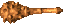
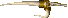
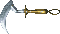
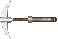
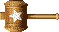
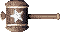
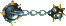

# Summary
| Name | Seal | Atk | Slot | Buy | Sell | Phrase | Info |
|-|-|-|-|-|-|-|-|
|[Wooden Sword](#woodensword)|-|2|1|3000|1500|-|Found with +4 ~ +8 upgrade value.|
|[Club](#club)|-|3|3|400|200|コルヤギ|-|
|[Nagamaki](#nagamaki)|-|6|4|700|300|こぷやほ|-|
|[Sacred Sword](#sacredsword)|-|8|14|45000|20000|-|-|
|[Katana](#katana)|-|10|5|900|400|みぬれふ|-|
|[Dotanuki](#dotanuki)|-|12|6|3600|1200|-|-|
|[Ivory Sword](#ivorysword)|-|13|4|4000|1600|-|Rustproof.|
|[Manji-Kabura](#manji-kabura)|-|18|5|15000|7000|るおへぎ|-|
|[Daisangen Sword](#daisangensword)|-|20|9|48000|32000|-|Rustproof. Synthesize 3 中 seals onto an Ivory Sword.|
|[Fiery Fuuma](#fieryfuuma)|-|30|10|20000|10000|-|Katana+99 with 5 seals → Blacksmith.|
|[Mijinha](#mijinha)|-|50|16|60000|40000|-|-|
|[Kaburasutegi](#kaburasutegi)|-|99|12|55000|20000|-|Manji-Kabura (月, 火, 水, 木, 金) → Blacksmith.|
|[Ghost Sickle](#ghostsickle)|仏|5|5|5000|2000|-|Deals x1.5 damage to Ghost types.|
|[Drain Buster](#drainbuster)|ド|6|5|5000|2500|-|Deals x1.5 damage to Drain types.|
|[Cyclops Killer](#cyclopskiller)|目|9|4|4500|2000|-|Deals x1.5 damage to Cyclops types.|
|[Crescent Arm](#crescentarm)|月|14|6|50000|25000|-|Deals x1.5 damage to Bomb types.|
|[Dragon Killer](#dragonkiller)|竜|15|7|10000|5000|-|Deals x1.5 damage to Dragon types.|
|[Ryujin Sword](#ryujinsword)|龍|25|7|30000|15000|-|Deals x2.0 damage to Dragon types. Synthesize 3 竜 seals onto a Dragon Killer.|
|[Gamarra Whip](#gamarrawhip)|銭|2|4|16000|8000|-|30% chance to turn defeated monsters into Gitan.|
|[Pickaxe](#pickaxe)|掘|2|5|3500|1600|ヨキタモ|Dig through walls. Breaks after digging for a while.|
|[Gobo](#gobo)|食|3|2|500|250|-|Can be eaten to restore fullness by 20%. Lost if eaten.|
|[Homing Blade](#homingblade)|必|3|3|10000|5000|てよだぼ|Raises attack accuracy to 100%.|
|[Onigiri Sword](#onigirisword)|に|3|4|10000|5000|-|8% chance to turn defeated monsters into riceballs.|
|[Golden Sword](#goldensword)|金|3|5|6000|3000|-|Rustproof. (Blue seal)|
|[Dried Bonito](#driedbonito)|か|4|2|2000|1000|ルコウス|Bite to restore 30% fullness, but -1 upgrade value.|
|[Fish Spear](#fishspear)|水|4|5|4000|1600|パカリツ|Lets you hit underwater monsters.|
|[Razor Wind](#razorwind)|三|5|4|5000|2500|ほんうじ|Lets you attack in a 3-way pattern.|
|[Healing Sword](#healingsword)|回|6|3|20000|10000|-|Restore HP equal to 1/3 of damage dealt.|
|[Kengo's Katana](#kengo'skatana)|ケ|7|4|3200|900|-|Chance to fling a weapon when attacking an enemy.|
|[Spark Sword](#sparksword)|ス|7|6|15000|7500|-|Guarantees a critical hit after missing 2 attacks.|
|[Wonder Pickaxe](#wonderpickaxe)|サ|13|4|20000|10000|-|Dig through walls. Will never break.|
|[Disposable Sword](#disposablesword)|捨|35|3|3000|1500|-|Decrease upgrade value by 1 when you deal damage.|
|[Mallet](#mallet)|木|3|5|4000|2000|タエチメ|Two-handed. Breaks traps. Can break.|
|[Power Pole](#powerpole)|-|5|4|20000|10000|-|Two-handed. Retreat 1 tile after hitting an enemy or wall.|
|[Iron Hammer](#ironhammer)|鉄|5|5|20000|10000|-|Two-handed. Breaks traps. Will never break.|
|[Morning Star](#morningstar)|-|5|6|5000|2500|-|Two-handed. Lets you attack in a 1 tile radius.|
|[Spear](#spear)|-|6|7|10000|4000|ヌヌセラ|Two-handed. Piercing attack 2 tiles forward.|
|[Minotaur's Axe](#minotaur'saxe)|会|8|11|6000|2400|-|Two-handed. 35% chance to deal a critical hit.|
|[Ironhead's Head](#ironhead'shead)|-|9|7|5000|2500|-|Two-handed. Attack a target up to 3 tiles forward.|

# Details

### Wooden Sword

  

Low attack, but comes with an upgrade value ranging from +4 to +8. 
It's never found cursed. Use it as synthesis fodder to strengthen a stronger weapon.

|Seal|Atk|Slots|Buy|Sell|+1|Stack|Phrase EN|Phrase JP|
|-|-|-|-|-|-|-|-|-|
|-|2|1|3000|1500|300|-|-|-|

Locations:

<table>
  <tr>
    <th>Small Valley</th>
    <td>-</td>
    <th>Hidden Hole</th>
    <td>-</td>
  </tr>
  <tr>
    <th>Shuten Easy</th>
    <td>-</td>
    <th>Halfway Well</th>
    <td>-</td>
  </tr>
  <tr>
    <th>Shuten Mid</th>
    <td>-</td>
    <th>Sealed Room</th>
    <td>-</td>
  </tr>
  <tr>
    <th>Shuten Hard</th>
    <td>-</td>
    <th>Road to the End</th>
    <td>-</td>
  </tr>
  <tr>
    <th>Onigashima</th>
    <td>Trader</td>
  </tr>
</table>

### Club

  

Said to be the weakest weapon. 
However, it has 3 slots so it can be used as a base when making a Healing Sword. 
Ally Iai or Shihan will always fling a Club in dungeons where weapons normally do not appear.

|Seal|Atk|Slots|Buy|Sell|+1|Stack|Phrase EN|Phrase JP|
|-|-|-|-|-|-|-|-|-|
|-|3|3|400|200|20|-|???|コルヤギ|

Locations:

<table>
  <tr>
    <th>Small Valley</th>
    <td>Floor</td>
    <th>Hidden Hole</th>
    <td>-</td>
  </tr>
  <tr>
    <th>Shuten Easy</th>
    <td>Floor</td>
    <th>Halfway Well</th>
    <td>-</td>
  </tr>
  <tr>
    <th>Shuten Mid</th>
    <td>Floor, Trader</td>
    <th>Sealed Room</th>
    <td>Presto</td>
  </tr>
  <tr>
    <th>Shuten Hard</th>
    <td>Trader</td>
    <th>Road to the End</th>
    <td>Floor, Presto</td>
  </tr>
  <tr>
    <th>Onigashima</th>
    <td>Floor</td>
  </tr>
</table>

### Nagamaki

  

Stronger than a Club, but it's still pretty weak. 
It's often used as a base when making a Healing Sword.

|Seal|Atk|Slots|Buy|Sell|+1|Stack|Phrase EN|Phrase JP|
|-|-|-|-|-|-|-|-|-|
|-|6|4|700|300|35|-|???|こぷやほ|

Locations:

<table>
  <tr>
    <th>Small Valley</th>
    <td>-</td>
    <th>Hidden Hole</th>
    <td>-</td>
  </tr>
  <tr>
    <th>Shuten Easy</th>
    <td>Floor</td>
    <th>Halfway Well</th>
    <td>-</td>
  </tr>
  <tr>
    <th>Shuten Mid</th>
    <td>Floor, Trader</td>
    <th>Sealed Room</th>
    <td>Presto</td>
  </tr>
  <tr>
    <th>Shuten Hard</th>
    <td>Floor, Presto, Shop, Trader</td>
    <th>Road to the End</th>
    <td>Floor, Presto</td>
  </tr>
  <tr>
    <th>Onigashima</th>
    <td>Floor</td>
  </tr>
</table>

### Sacred Sword

  

Has the second highest number of synthesis slots. 
Popular as a secondary weapon with stacked effects. (examples: 飯, 火, or 幸) 
Useful as a seal container to free up storage space while preparing a Mijinha or Kaburasutegi.

|Seal|Atk|Slots|Buy|Sell|+1|Stack|Phrase EN|Phrase JP|
|-|-|-|-|-|-|-|-|-|
|-|8|14|45000|20000|2250|-|-|-|

Locations:

<table>
  <tr>
    <th>Small Valley</th>
    <td>-</td>
    <th>Hidden Hole</th>
    <td>-</td>
  </tr>
  <tr>
    <th>Shuten Easy</th>
    <td>-</td>
    <th>Halfway Well</th>
    <td>-</td>
  </tr>
  <tr>
    <th>Shuten Mid</th>
    <td>-</td>
    <th>Sealed Room</th>
    <td>Golden</td>
  </tr>
  <tr>
    <th>Shuten Hard</th>
    <td>-</td>
    <th>Road to the End</th>
    <td>-</td>
  </tr>
  <tr>
    <th>Onigashima</th>
    <td>-</td>
  </tr>
</table>

### Katana

  

Popular weapon among wanderers. 
It has decent attack and 5 slots, so it can be used as a main weapon. 
However, it's still on the weaker side for post-game dungeons. 
Can be used as a base for making a Healing Sword, or as a secondary weapon with stacked seals. 
Take a Katana+99 with 5 seals to the blacksmith to transform it into a Fiery Fuuma.

|Seal|Atk|Slots|Buy|Sell|+1|Stack|Phrase EN|Phrase JP|
|-|-|-|-|-|-|-|-|-|
|-|10|5|900|400|45|-|???|みぬれふ|

Locations:

<table>
  <tr>
    <th>Small Valley</th>
    <td>-</td>
    <th>Hidden Hole</th>
    <td>-</td>
  </tr>
  <tr>
    <th>Shuten Easy</th>
    <td>Floor, Presto</td>
    <th>Halfway Well</th>
    <td>-</td>
  </tr>
  <tr>
    <th>Shuten Mid</th>
    <td>Floor, Presto, Shop, Trader</td>
    <th>Sealed Room</th>
    <td>Presto</td>
  </tr>
  <tr>
    <th>Shuten Hard</th>
    <td>Floor, Presto, Shop, Trader, Golden</td>
    <th>Road to the End</th>
    <td>Floor, Presto</td>
  </tr>
  <tr>
    <th>Onigashima</th>
    <td>Floor</td>
  </tr>
</table>

### Dotanuki

  

Very popular as a base weapon. However, it's quite rare before post-game dungeons. 
Can be obtained from Surprise Pots found on 15F of Shuten Trail Hard, or from a Trader in Onigashima.

|Seal|Atk|Slots|Buy|Sell|+1|Stack|Phrase EN|Phrase JP|
|-|-|-|-|-|-|-|-|-|
|-|12|6|3600|1200|180|-|-|-|

Locations:

<table>
  <tr>
    <th>Small Valley</th>
    <td>-</td>
    <th>Hidden Hole</th>
    <td>-</td>
  </tr>
  <tr>
    <th>Shuten Easy</th>
    <td>-</td>
    <th>Halfway Well</th>
    <td>-</td>
  </tr>
  <tr>
    <th>Shuten Mid</th>
    <td>-</td>
    <th>Sealed Room</th>
    <td>Presto</td>
  </tr>
  <tr>
    <th>Shuten Hard</th>
    <td>Surprise</td>
    <th>Road to the End</th>
    <td>Floor, Presto</td>
  </tr>
  <tr>
    <th>Onigashima</th>
    <td>Trader</td>
  </tr>
</table>

### Ivory Sword

  

Sword made of Ivory. Rustproof. 
Transforms into Daisangen Sword with 3 中 seals. 
The rustproof ability won't transfer if used as synthesis fodder.

|Seal|Atk|Slots|Buy|Sell|+1|Stack|Phrase EN|Phrase JP|
|-|-|-|-|-|-|-|-|-|
|-|13|4|4000|1600|200|-|-|-|

Locations:

<table>
  <tr>
    <th>Small Valley</th>
    <td>-</td>
    <th>Hidden Hole</th>
    <td>-</td>
  </tr>
  <tr>
    <th>Shuten Easy</th>
    <td>-</td>
    <th>Halfway Well</th>
    <td>-</td>
  </tr>
  <tr>
    <th>Shuten Mid</th>
    <td>-</td>
    <th>Sealed Room</th>
    <td>Presto</td>
  </tr>
  <tr>
    <th>Shuten Hard</th>
    <td>-</td>
    <th>Road to the End</th>
    <td>Floor, Presto, Golden</td>
  </tr>
  <tr>
    <th>Onigashima</th>
    <td>Golden</td>
  </tr>
</table>

### Manji-Kabura

  

High attack, but 1 less slot than Dotanuki. 
Bring a Manji-Kabra with 月, 火, 水, 木, and 金 seals (in that order) to the blacksmith to turn it into a Kaburasutegi.

|Seal|Atk|Slots|Buy|Sell|+1|Stack|Phrase EN|Phrase JP|
|-|-|-|-|-|-|-|-|-|
|-|18|5|15000|7000|2250|-|???|るおへぎ|

Locations:

<table>
  <tr>
    <th>Small Valley</th>
    <td>-</td>
    <th>Hidden Hole</th>
    <td>-</td>
  </tr>
  <tr>
    <th>Shuten Easy</th>
    <td>-</td>
    <th>Halfway Well</th>
    <td>-</td>
  </tr>
  <tr>
    <th>Shuten Mid</th>
    <td>-</td>
    <th>Sealed Room</th>
    <td>Presto</td>
  </tr>
  <tr>
    <th>Shuten Hard</th>
    <td>-</td>
    <th>Road to the End</th>
    <td>Presto, Golden</td>
  </tr>
  <tr>
    <th>Onigashima</th>
    <td>Presto</td>
  </tr>
</table>

### Daisangen Sword

  

Created by synthesizing 3 中 seals onto an Ivory Sword. Rustproof. 
Difficult to make due to the rarity of Dragon Tile Bracelets. 
Cannot be used as synthesis fodder, or as a base for Healing Sword.

|Seal|Atk|Slots|Buy|Sell|+1|Stack|Phrase EN|Phrase JP|
|-|-|-|-|-|-|-|-|-|
|-|20|9|48000|32000|4800|-|-|-|

Locations:

<table>
  <tr>
    <th>Small Valley</th>
    <td>-</td>
    <th>Hidden Hole</th>
    <td>-</td>
  </tr>
  <tr>
    <th>Shuten Easy</th>
    <td>-</td>
    <th>Halfway Well</th>
    <td>-</td>
  </tr>
  <tr>
    <th>Shuten Mid</th>
    <td>-</td>
    <th>Sealed Room</th>
    <td>-</td>
  </tr>
  <tr>
    <th>Shuten Hard</th>
    <td>-</td>
    <th>Road to the End</th>
    <td>-</td>
  </tr>
  <tr>
    <th>Onigashima</th>
    <td>-</td>
  </tr>
</table>

### Fiery Fuuma

  

3rd strongest sword in the game. 
Obtained by bringing a Katana+99 with 5 seals to the blacksmith. 
It's weaker than a Katana+99 right after transforming, and alternatives like Ryujin Sword 
are pretty close in power and are easier to make, so it's more for collectors.

|Seal|Atk|Slots|Buy|Sell|+1|Stack|Phrase EN|Phrase JP|
|-|-|-|-|-|-|-|-|-|
|-|30|10|20000|10000|2000|-|-|-|

Locations:

<table>
  <tr>
    <th>Small Valley</th>
    <td>-</td>
    <th>Hidden Hole</th>
    <td>-</td>
  </tr>
  <tr>
    <th>Shuten Easy</th>
    <td>-</td>
    <th>Halfway Well</th>
    <td>-</td>
  </tr>
  <tr>
    <th>Shuten Mid</th>
    <td>-</td>
    <th>Sealed Room</th>
    <td>-</td>
  </tr>
  <tr>
    <th>Shuten Hard</th>
    <td>-</td>
    <th>Road to the End</th>
    <td>-</td>
  </tr>
  <tr>
    <th>Onigashima</th>
    <td>-</td>
  </tr>
</table>

### Mijinha

  

Legendary sword exclusive to Shiren 2, and it's the 2nd strongest sword in the game. 
Has the highest number of slots among all weapons. 
Obtained from 90-95F golden interval treasure chests inside the "Road to the End" dungeon.

|Seal|Atk|Slots|Buy|Sell|+1|Stack|Phrase EN|Phrase JP|
|-|-|-|-|-|-|-|-|-|
|-|50|16|60000|40000|12000|-|-|-|

Locations:

<table>
  <tr>
    <th>Small Valley</th>
    <td>-</td>
    <th>Hidden Hole</th>
    <td>-</td>
  </tr>
  <tr>
    <th>Shuten Easy</th>
    <td>-</td>
    <th>Halfway Well</th>
    <td>-</td>
  </tr>
  <tr>
    <th>Shuten Mid</th>
    <td>-</td>
    <th>Sealed Room</th>
    <td>-</td>
  </tr>
  <tr>
    <th>Shuten Hard</th>
    <td>-</td>
    <th>Road to the End</th>
    <td>Treasure</td>
  </tr>
  <tr>
    <th>Onigashima</th>
    <td>-</td>
  </tr>
</table>

### Kaburasutegi

  

Strongest sword in the game. 
Obtained by bringing a Manji-Kabura with 月, 火, 水, 木, and 金 seals (in that order) to the blacksmith. The 火 seal can be from either Flame Grass or Dragon Grass.

|Seal|Atk|Slots|Buy|Sell|+1|Stack|Phrase EN|Phrase JP|
|-|-|-|-|-|-|-|-|-|
|-|99|12|55000|20000|8250|-|-|-|

Locations:

<table>
  <tr>
    <th>Small Valley</th>
    <td>-</td>
    <th>Hidden Hole</th>
    <td>-</td>
  </tr>
  <tr>
    <th>Shuten Easy</th>
    <td>-</td>
    <th>Halfway Well</th>
    <td>-</td>
  </tr>
  <tr>
    <th>Shuten Mid</th>
    <td>-</td>
    <th>Sealed Room</th>
    <td>-</td>
  </tr>
  <tr>
    <th>Shuten Hard</th>
    <td>-</td>
    <th>Road to the End</th>
    <td>-</td>
  </tr>
  <tr>
    <th>Onigashima</th>
    <td>-</td>
  </tr>
</table>

### Ghost Sickle

  

Weapon that deals x1.5 damage to Ghost type monsters. 
(Gale, Pumphantasm, Yamikichi, and Bone Dragon families) 
Great seal to have in dungeons where Typhoon appears.

|Seal|Atk|Slots|Buy|Sell|+1|Stack|Phrase EN|Phrase JP|
|-|-|-|-|-|-|-|-|-|
|仏|5|5|5000|2000|250|Yes|-|-|

Stacked Effect:

<table>
  <tr>
    <th>Seals</th>
    <th></th>
    <th>1</th>
    <th>2</th>
    <th>3</th>
    <th>4</th>
    <th>5</th>
    <th>6</th>
    <th>7</th>
    <th>8</th>
  </tr>
  <tr>
    <th></th>
    <th>9</th>
    <th>10</th>
    <th>11</th>
    <th>12</th>
    <th>13</th>
    <th>14</th>
    <th>15</th>
    <th>16</th>
    <th>17</th>
  </tr>
  <tr>
    <td>Damage (%)</td>
    <td></td>
    <td>150</td>
    <td>160</td>
    <td>170</td>
    <td>180</td>
    <td>190</td>
    <td>200</td>
    <td>240</td>
    <td>270</td>
  </tr>
  <tr>
    <td></td>
    <td>300</td>
    <td>350</td>
    <td>400</td>
    <td>450</td>
    <td>500</td>
    <td>550</td>
    <td>600</td>
    <td>650</td>
    <td>700</td>
  </tr>
</table>

Locations:

<table>
  <tr>
    <th>Small Valley</th>
    <td>-</td>
    <th>Hidden Hole</th>
    <td>-</td>
  </tr>
  <tr>
    <th>Shuten Easy</th>
    <td>Presto</td>
    <th>Halfway Well</th>
    <td>-</td>
  </tr>
  <tr>
    <th>Shuten Mid</th>
    <td>Presto</td>
    <th>Sealed Room</th>
    <td>Presto</td>
  </tr>
  <tr>
    <th>Shuten Hard</th>
    <td>Floor, Presto, Golden</td>
    <th>Road to the End</th>
    <td>Floor, Presto, Surprise, Shop, Trader</td>
  </tr>
  <tr>
    <th>Onigashima</th>
    <td>Presto, Surprise, Shop, Trader</td>
  </tr>
</table>

### Drain Buster

  

Weapon that deals x1.5 damage to Drain type monsters. 
(Slug, Scorpion, Hunger Puppet families, and Twisty Hani) 
Nice seal to have, since the special attacks of Drain type monsters can be quite bothersome.

|Seal|Atk|Slots|Buy|Sell|+1|Stack|Phrase EN|Phrase JP|
|-|-|-|-|-|-|-|-|-|
|ド|6|5|5000|2500|250|Yes|-|-|

Stacked Effect:

<table>
  <tr>
    <th>Seals</th>
    <th></th>
    <th>1</th>
    <th>2</th>
    <th>3</th>
    <th>4</th>
    <th>5</th>
    <th>6</th>
    <th>7</th>
    <th>8</th>
  </tr>
  <tr>
    <th></th>
    <th>9</th>
    <th>10</th>
    <th>11</th>
    <th>12</th>
    <th>13</th>
    <th>14</th>
    <th>15</th>
    <th>16</th>
    <th>17</th>
  </tr>
  <tr>
    <td>Damage (%)</td>
    <td></td>
    <td>150</td>
    <td>160</td>
    <td>170</td>
    <td>180</td>
    <td>190</td>
    <td>200</td>
    <td>240</td>
    <td>270</td>
  </tr>
  <tr>
    <td></td>
    <td>300</td>
    <td>500</td>
    <td>500</td>
    <td>500</td>
    <td>500</td>
    <td>500</td>
    <td>500</td>
    <td>500</td>
    <td>500</td>
  </tr>
</table>

Locations:

<table>
  <tr>
    <th>Small Valley</th>
    <td>-</td>
    <th>Hidden Hole</th>
    <td>-</td>
  </tr>
  <tr>
    <th>Shuten Easy</th>
    <td>-</td>
    <th>Halfway Well</th>
    <td>-</td>
  </tr>
  <tr>
    <th>Shuten Mid</th>
    <td>Presto</td>
    <th>Sealed Room</th>
    <td>Presto</td>
  </tr>
  <tr>
    <th>Shuten Hard</th>
    <td>Golden</td>
    <th>Road to the End</th>
    <td>Floor, Presto, Surprise, Shop, Trader</td>
  </tr>
  <tr>
    <th>Onigashima</th>
    <td>Presto, Surprise, Shop, Trader</td>
  </tr>
</table>

### Cyclops Killer

  

Weapon that deals x1.5 damage to One-eyed monsters. 
(Ironhead, Golem, and Gazer families) 
Gazer's hypnosis can be nullified with an Echo Shield, so this seal isn't very necessary.

|Seal|Atk|Slots|Buy|Sell|+1|Stack|Phrase EN|Phrase JP|
|-|-|-|-|-|-|-|-|-|
|目|9|4|4500|2000|225|Yes|-|-|

Stacked Effect:

<table>
  <tr>
    <th>Seals</th>
    <th></th>
    <th>1</th>
    <th>2</th>
    <th>3</th>
    <th>4</th>
    <th>5</th>
    <th>6</th>
    <th>7</th>
    <th>8</th>
  </tr>
  <tr>
    <th></th>
    <th>9</th>
    <th>10</th>
    <th>11</th>
    <th>12</th>
    <th>13</th>
    <th>14</th>
    <th>15</th>
    <th>16</th>
    <th>17</th>
  </tr>
  <tr>
    <td>Damage (%)</td>
    <td></td>
    <td>150</td>
    <td>160</td>
    <td>170</td>
    <td>180</td>
    <td>190</td>
    <td>200</td>
    <td>240</td>
    <td>270</td>
  </tr>
  <tr>
    <td></td>
    <td>300</td>
    <td>350</td>
    <td>400</td>
    <td>450</td>
    <td>500</td>
    <td>550</td>
    <td>600</td>
    <td>650</td>
    <td>700</td>
  </tr>
</table>

Locations:

<table>
  <tr>
    <th>Small Valley</th>
    <td>-</td>
    <th>Hidden Hole</th>
    <td>-</td>
  </tr>
  <tr>
    <th>Shuten Easy</th>
    <td>Presto</td>
    <th>Halfway Well</th>
    <td>-</td>
  </tr>
  <tr>
    <th>Shuten Mid</th>
    <td>Presto</td>
    <th>Sealed Room</th>
    <td>Presto</td>
  </tr>
  <tr>
    <th>Shuten Hard</th>
    <td>Floor, Presto, Golden</td>
    <th>Road to the End</th>
    <td>Floor, Presto, Surprise, Shop, Trader</td>
  </tr>
  <tr>
    <th>Onigashima</th>
    <td>Presto, Surprise, Shop, Trader</td>
  </tr>
</table>

### Crescent Arm

  

Weapon that deals x1.5 damage to Bomb type monsters. 
(Wolf Droid family, Pop Tank, Cranky Tank, and Patient Bag) 
Obtained each time you defeat Boss Oni in Onigashima after finishing the main story.

|Seal|Atk|Slots|Buy|Sell|+1|Stack|Phrase EN|Phrase JP|
|-|-|-|-|-|-|-|-|-|
|月|14|6|50000|25000|5000|Yes|-|-|

Stacked Effect:

<table>
  <tr>
    <th>Seals</th>
    <th></th>
    <th>1</th>
    <th>2</th>
    <th>3</th>
    <th>4</th>
    <th>5</th>
    <th>6</th>
    <th>7</th>
    <th>8</th>
  </tr>
  <tr>
    <th></th>
    <th>9</th>
    <th>10</th>
    <th>11</th>
    <th>12</th>
    <th>13</th>
    <th>14</th>
    <th>15</th>
    <th>16</th>
    <th>17</th>
  </tr>
  <tr>
    <td>Damage (%)</td>
    <td></td>
    <td>150</td>
    <td>160</td>
    <td>170</td>
    <td>180</td>
    <td>190</td>
    <td>200</td>
    <td>240</td>
    <td>270</td>
  </tr>
  <tr>
    <td></td>
    <td>300</td>
    <td>350</td>
    <td>400</td>
    <td>450</td>
    <td>500</td>
    <td>550</td>
    <td>600</td>
    <td>650</td>
    <td>700</td>
  </tr>
</table>

Locations:

<table>
  <tr>
    <th>Small Valley</th>
    <td>-</td>
    <th>Hidden Hole</th>
    <td>-</td>
  </tr>
  <tr>
    <th>Shuten Easy</th>
    <td>-</td>
    <th>Halfway Well</th>
    <td>-</td>
  </tr>
  <tr>
    <th>Shuten Mid</th>
    <td>-</td>
    <th>Sealed Room</th>
    <td>-</td>
  </tr>
  <tr>
    <th>Shuten Hard</th>
    <td>-</td>
    <th>Road to the End</th>
    <td>-</td>
  </tr>
  <tr>
    <th>Onigashima</th>
    <td>-</td>
  </tr>
</table>

### Dragon Killer

  

Weapon that deals x1.5 damage to Dragon type monsters. 
(Shaaga, Aqua Dragon, Shotfish, Dragon, and Bone Dragon families) 
Synthesize 3 竜 seals onto it to transform it into a Ryujin Sword. 
Excellent as a main weapon.

|Seal|Atk|Slots|Buy|Sell|+1|Stack|Phrase EN|Phrase JP|
|-|-|-|-|-|-|-|-|-|
|竜|15|7|10000|5000|500|Yes|-|-|

Stacked Effect:

<table>
  <tr>
    <th>Seals</th>
    <th></th>
    <th>1</th>
    <th>2</th>
    <th>3</th>
    <th>4</th>
    <th>5</th>
    <th>6</th>
    <th>7</th>
    <th>8</th>
  </tr>
  <tr>
    <th></th>
    <th>9</th>
    <th>10</th>
    <th>11</th>
    <th>12</th>
    <th>13</th>
    <th>14</th>
    <th>15</th>
    <th>16</th>
    <th></th>
  </tr>
  <tr>
    <td>Damage (%)</td>
    <td></td>
    <td>150</td>
    <td>160</td>
    <td>170</td>
    <td>180</td>
    <td>190</td>
    <td>200</td>
    <td>240</td>
    <td>270</td>
  </tr>
  <tr>
    <td></td>
    <td>300</td>
    <td>350</td>
    <td>400</td>
    <td>450</td>
    <td>500</td>
    <td>550</td>
    <td>600</td>
    <td>650</td>
    <td></td>
  </tr>
</table>

Locations:

<table>
  <tr>
    <th>Small Valley</th>
    <td>-</td>
    <th>Hidden Hole</th>
    <td>-</td>
  </tr>
  <tr>
    <th>Shuten Easy</th>
    <td>-</td>
    <th>Halfway Well</th>
    <td>-</td>
  </tr>
  <tr>
    <th>Shuten Mid</th>
    <td>-</td>
    <th>Sealed Room</th>
    <td>-</td>
  </tr>
  <tr>
    <th>Shuten Hard</th>
    <td>-</td>
    <th>Road to the End</th>
    <td>Golden</td>
  </tr>
  <tr>
    <th>Onigashima</th>
    <td>Golden</td>
  </tr>
</table>

### Ryujin Sword

  

Powerful weapon created by synthesizing 3 竜 seals onto a Dragon Killer. 
Deals x2.0 damage to Dragon type monsters. 
(Shaaga, Aqua Dragon, Shotfish, Dragon, and Bone Dragon families) 
Often used as a main weapon while working towards Mijinha or Kaburasutegi. 
Cannot be used as a base for Healing Sword.

|Seal|Atk|Slots|Buy|Sell|+1|Stack|Phrase EN|Phrase JP|
|-|-|-|-|-|-|-|-|-|
|龍|25|7|30000|15000|3000|Yes|-|-|

Stacked Effect:

<table>
  <tr>
    <th>Seals</th>
    <th></th>
    <th>1</th>
    <th>2</th>
    <th>3</th>
    <th>4</th>
    <th>5</th>
    <th>6</th>
    <th>7</th>
    <th>8</th>
  </tr>
  <tr>
    <th></th>
    <th>9</th>
    <th>10</th>
    <th>11</th>
    <th>12</th>
    <th>13</th>
    <th>14</th>
    <th>15</th>
    <th>16</th>
    <th>17</th>
  </tr>
  <tr>
    <td>Damage (%)</td>
    <td></td>
    <td>200</td>
    <td>220</td>
    <td>250</td>
    <td>270</td>
    <td>300</td>
    <td>350</td>
    <td>400</td>
    <td>500</td>
  </tr>
  <tr>
    <td></td>
    <td>550</td>
    <td>600</td>
    <td>600</td>
    <td>600</td>
    <td>600</td>
    <td>600</td>
    <td>600</td>
    <td>600</td>
    <td>600</td>
  </tr>
</table>

Locations:

<table>
  <tr>
    <th>Small Valley</th>
    <td>-</td>
    <th>Hidden Hole</th>
    <td>-</td>
  </tr>
  <tr>
    <th>Shuten Easy</th>
    <td>-</td>
    <th>Halfway Well</th>
    <td>-</td>
  </tr>
  <tr>
    <th>Shuten Mid</th>
    <td>-</td>
    <th>Sealed Room</th>
    <td>-</td>
  </tr>
  <tr>
    <th>Shuten Hard</th>
    <td>-</td>
    <th>Road to the End</th>
    <td>-</td>
  </tr>
  <tr>
    <th>Onigashima</th>
    <td>-</td>
  </tr>
</table>

### Gamarra Whip

  

Weapon that hosts the spirit of a Gamarra. 
Has a 30% chance to transform defeated monsters into Gitan. 
Defeated monsters can still drop other items, such as area drops or riceballs. (飯 seal)

|Seal|Atk|Slots|Buy|Sell|+1|Stack|Phrase EN|Phrase JP|
|-|-|-|-|-|-|-|-|-|
|銭|2|4|16000|8000|800|Yes|-|-|

Stacked Effect:

<table>
  <tr>
    <th>Seals</th>
    <th></th>
    <th>1</th>
    <th>2</th>
    <th>3</th>
    <th>4</th>
    <th>5</th>
    <th>6</th>
    <th>7</th>
    <th>8</th>
  </tr>
  <tr>
    <th></th>
    <th>9</th>
    <th>10</th>
    <th>11</th>
    <th>12</th>
    <th>13</th>
    <th>14</th>
    <th>15</th>
    <th>16</th>
    <th>17</th>
  </tr>
  <tr>
    <td>Chance (%)</td>
    <td></td>
    <td>30</td>
    <td>35</td>
    <td>40</td>
    <td>45</td>
    <td>50</td>
    <td>55</td>
    <td>60</td>
    <td>65</td>
  </tr>
  <tr>
    <td></td>
    <td>70</td>
    <td>75</td>
    <td>80</td>
    <td>85</td>
    <td>90</td>
    <td>95</td>
    <td>96</td>
    <td>97</td>
    <td>98</td>
  </tr>
</table>

Locations:

<table>
  <tr>
    <th>Small Valley</th>
    <td>-</td>
    <th>Hidden Hole</th>
    <td>-</td>
  </tr>
  <tr>
    <th>Shuten Easy</th>
    <td>-</td>
    <th>Halfway Well</th>
    <td>-</td>
  </tr>
  <tr>
    <th>Shuten Mid</th>
    <td>-</td>
    <th>Sealed Room</th>
    <td>-</td>
  </tr>
  <tr>
    <th>Shuten Hard</th>
    <td>Treasure</td>
    <th>Road to the End</th>
    <td>-</td>
  </tr>
  <tr>
    <th>Onigashima</th>
    <td>-</td>
  </tr>
</table>

### Pickaxe

  

Pickaxe that can dig through walls. 
Breaks after digging for a while. (15 ~ 60 uses) 
Useful for creating paths when stealing from shops, or making shortcuts in general. 
Synthesize 5 堀 seals onto it to transform it into a Wonder Pickaxe.

|Seal|Atk|Slots|Buy|Sell|+1|Stack|Phrase EN|Phrase JP|
|-|-|-|-|-|-|-|-|-|
|堀|2|5|3500|1600|175|No|???|ヨキタモ|

Locations:

<table>
  <tr>
    <th>Small Valley</th>
    <td>-</td>
    <th>Hidden Hole</th>
    <td>-</td>
  </tr>
  <tr>
    <th>Shuten Easy</th>
    <td>-</td>
    <th>Halfway Well</th>
    <td>Floor</td>
  </tr>
  <tr>
    <th>Shuten Mid</th>
    <td>-</td>
    <th>Sealed Room</th>
    <td>Presto</td>
  </tr>
  <tr>
    <th>Shuten Hard</th>
    <td>-</td>
    <th>Road to the End</th>
    <td>Floor, Presto</td>
  </tr>
  <tr>
    <th>Onigashima</th>
    <td>Floor, Presto</td>
  </tr>
</table>

### Gobo

  

Gobo, also known as burdock root, used as a weapon. 
Can be eaten to restore fullness by 20%. The weapon is lost if eaten.

|Seal|Atk|Slots|Buy|Sell|+1|Stack|Phrase EN|Phrase JP|
|-|-|-|-|-|-|-|-|-|
|食|3|2|500|250|25|No|-|-|

Locations:

<table>
  <tr>
    <th>Small Valley</th>
    <td>-</td>
    <th>Hidden Hole</th>
    <td>-</td>
  </tr>
  <tr>
    <th>Shuten Easy</th>
    <td>-</td>
    <th>Halfway Well</th>
    <td>-</td>
  </tr>
  <tr>
    <th>Shuten Mid</th>
    <td>-</td>
    <th>Sealed Room</th>
    <td>Presto</td>
  </tr>
  <tr>
    <th>Shuten Hard</th>
    <td>-</td>
    <th>Road to the End</th>
    <td>Floor, Presto</td>
  </tr>
  <tr>
    <th>Onigashima</th>
    <td>Floor, Presto</td>
  </tr>
</table>

### Homing Blade

  

Sword that ensures all of your attacks will connect. 
Greatly reduces the amount of danger within an adventure, since it eliminates actions received as a result of missed attacks. 
Some say using it is cheating, and therefore personally ban its usage.

|Seal|Atk|Slots|Buy|Sell|+1|Stack|Phrase EN|Phrase JP|
|-|-|-|-|-|-|-|-|-|
|必|3|3|10000|5000|500|No|???|てよだぼ|

Locations:

<table>
  <tr>
    <th>Small Valley</th>
    <td>-</td>
    <th>Hidden Hole</th>
    <td>-</td>
  </tr>
  <tr>
    <th>Shuten Easy</th>
    <td>-</td>
    <th>Halfway Well</th>
    <td>-</td>
  </tr>
  <tr>
    <th>Shuten Mid</th>
    <td>-</td>
    <th>Sealed Room</th>
    <td>Golden</td>
  </tr>
  <tr>
    <th>Shuten Hard</th>
    <td>-</td>
    <th>Road to the End</th>
    <td>-</td>
  </tr>
  <tr>
    <th>Onigashima</th>
    <td>-</td>
  </tr>
</table>

### Onigiri Sword

  

Weapon that hosts the spirit of a Nigiri Morph. 
Has a 8% chance to transform defeated monsters into riceballs. 
Its effect is more potent than the 飯 seal, and can eliminate hunger issues altogether.

|Seal|Atk|Slots|Buy|Sell|+1|Stack|Phrase EN|Phrase JP|
|-|-|-|-|-|-|-|-|-|
|に|3|4|10000|5000|500|Yes|-|-|

Stacked Effect:

<table>
  <tr>
    <th>Seals</th>
    <th></th>
    <th>1</th>
    <th>2</th>
    <th>3</th>
    <th>4</th>
    <th>5</th>
    <th>6</th>
    <th>7</th>
    <th>8</th>
  </tr>
  <tr>
    <th></th>
    <th>9</th>
    <th>10</th>
    <th>11</th>
    <th>12</th>
    <th>13</th>
    <th>14</th>
    <th>15</th>
    <th>16</th>
    <th>17</th>
  </tr>
  <tr>
    <td>Chance (%)</td>
    <td></td>
    <td>8</td>
    <td>12</td>
    <td>24</td>
    <td>36</td>
    <td>48</td>
    <td>60</td>
    <td>65</td>
    <td>70</td>
  </tr>
  <tr>
    <td></td>
    <td>75</td>
    <td>80</td>
    <td>85</td>
    <td>90</td>
    <td>95</td>
    <td>96</td>
    <td>97</td>
    <td>98</td>
    <td>99</td>
  </tr>
</table>

Locations:

<table>
  <tr>
    <th>Small Valley</th>
    <td>-</td>
    <th>Hidden Hole</th>
    <td>-</td>
  </tr>
  <tr>
    <th>Shuten Easy</th>
    <td>-</td>
    <th>Halfway Well</th>
    <td>-</td>
  </tr>
  <tr>
    <th>Shuten Mid</th>
    <td>-</td>
    <th>Sealed Room</th>
    <td>-</td>
  </tr>
  <tr>
    <th>Shuten Hard</th>
    <td>Treasure</td>
    <th>Road to the End</th>
    <td>-</td>
  </tr>
  <tr>
    <th>Onigashima</th>
    <td>-</td>
  </tr>
</table>

### Golden Sword

  

Sword made out of gold. Low attack, but it will never rust. 
Provides a blue 金 seal when synthesized. Monsoon Dolls will tear off a red 金 seal first, but a blue one has the same odds to be removed as the other seals.

|Seal|Atk|Slots|Buy|Sell|+1|Stack|Phrase EN|Phrase JP|
|-|-|-|-|-|-|-|-|-|
|金|3|5|6000|3000|300|No|-|-|

Locations:

<table>
  <tr>
    <th>Small Valley</th>
    <td>-</td>
    <th>Hidden Hole</th>
    <td>-</td>
  </tr>
  <tr>
    <th>Shuten Easy</th>
    <td>-</td>
    <th>Halfway Well</th>
    <td>-</td>
  </tr>
  <tr>
    <th>Shuten Mid</th>
    <td>-</td>
    <th>Sealed Room</th>
    <td>Presto, Treasure</td>
  </tr>
  <tr>
    <th>Shuten Hard</th>
    <td>-</td>
    <th>Road to the End</th>
    <td>Floor, Presto, Treasure</td>
  </tr>
  <tr>
    <th>Onigashima</th>
    <td>Golden, Treasure</td>
  </tr>
</table>

### Dried Bonito

  

Dried Bonito used as a weapon. 
Can be bitten to restore fullness by 30% at the cost of lowering upgrade value by 1. 
Cannot bite once the weapon's attack is at 0. 
Synthesize it onto a Disposable Sword to create a weapon that can be bitten 35 times. (1050% fullness)

|Seal|Atk|Slots|Buy|Sell|+1|Stack|Phrase EN|Phrase JP|
|-|-|-|-|-|-|-|-|-|
|か|4|2|2000|1000|100|No|???|ルコウス|

Locations:

<table>
  <tr>
    <th>Small Valley</th>
    <td>-</td>
    <th>Hidden Hole</th>
    <td>-</td>
  </tr>
  <tr>
    <th>Shuten Easy</th>
    <td>-</td>
    <th>Halfway Well</th>
    <td>-</td>
  </tr>
  <tr>
    <th>Shuten Mid</th>
    <td>-</td>
    <th>Sealed Room</th>
    <td>Presto</td>
  </tr>
  <tr>
    <th>Shuten Hard</th>
    <td>-</td>
    <th>Road to the End</th>
    <td>Floor, Presto, Shop</td>
  </tr>
  <tr>
    <th>Onigashima</th>
    <td>Floor, Presto, Shop</td>
  </tr>
</table>

### Fish Spear

  

Weapon that allows you to hit underwater monsters. 
Useful against monsters such as Shotfish, Spearfish, Orcan, Kappa, and Zalokleft. 
Rare drop from Lv2+ Spearfish monsters.

|Seal|Atk|Slots|Buy|Sell|+1|Stack|Phrase EN|Phrase JP|
|-|-|-|-|-|-|-|-|-|
|水|4|5|4000|1600|200|No|???|パカリツ|

Locations:

<table>
  <tr>
    <th>Small Valley</th>
    <td>-</td>
    <th>Hidden Hole</th>
    <td>Monster</td>
  </tr>
  <tr>
    <th>Shuten Easy</th>
    <td>-</td>
    <th>Halfway Well</th>
    <td>Monster</td>
  </tr>
  <tr>
    <th>Shuten Mid</th>
    <td>Monster</td>
    <th>Sealed Room</th>
    <td>Monster</td>
  </tr>
  <tr>
    <th>Shuten Hard</th>
    <td>-</td>
    <th>Road to the End</th>
    <td>Shop, Monster</td>
  </tr>
  <tr>
    <th>Onigashima</th>
    <td>Presto, Shop, Monster</td>
  </tr>
</table>

### Razor Wind

  

An enchanted sword that can attack in a 3-way pattern. 
Useful for monster house entrances and attacking around corners. 
Plays well with Healing Sword, along with Scout and Phantasm bracelets.

|Seal|Atk|Slots|Buy|Sell|+1|Stack|Phrase EN|Phrase JP|
|-|-|-|-|-|-|-|-|-|
|三|5|4|5000|2500|250|No|???|ほんうじ|

Locations:

<table>
  <tr>
    <th>Small Valley</th>
    <td>-</td>
    <th>Hidden Hole</th>
    <td>-</td>
  </tr>
  <tr>
    <th>Shuten Easy</th>
    <td>Floor, Presto</td>
    <th>Halfway Well</th>
    <td>-</td>
  </tr>
  <tr>
    <th>Shuten Mid</th>
    <td>Presto, Shop</td>
    <th>Sealed Room</th>
    <td>Presto</td>
  </tr>
  <tr>
    <th>Shuten Hard</th>
    <td>Floor, Presto, Shop, Golden</td>
    <th>Road to the End</th>
    <td>Floor, Presto, Surprise, Shop, Trader</td>
  </tr>
  <tr>
    <th>Onigashima</th>
    <td>Surprise, Shop, Trader</td>
  </tr>
</table>

### Healing Sword

  

Sword that restores HP equal to 1/3 of the damage dealt, out of the monster's remaining HP. 
Created by synthesizing 薬, 弟, and 命 seals onto a weapon. 
One of the best seals in the game, and synthesizing it should be prioritized.

|Seal|Atk|Slots|Buy|Sell|+1|Stack|Phrase EN|Phrase JP|
|-|-|-|-|-|-|-|-|-|
|回|6|3|20000|10000|2000|No|-|-|

Locations:

<table>
  <tr>
    <th>Small Valley</th>
    <td>-</td>
    <th>Hidden Hole</th>
    <td>-</td>
  </tr>
  <tr>
    <th>Shuten Easy</th>
    <td>-</td>
    <th>Halfway Well</th>
    <td>-</td>
  </tr>
  <tr>
    <th>Shuten Mid</th>
    <td>-</td>
    <th>Sealed Room</th>
    <td>-</td>
  </tr>
  <tr>
    <th>Shuten Hard</th>
    <td>-</td>
    <th>Road to the End</th>
    <td>-</td>
  </tr>
  <tr>
    <th>Onigashima</th>
    <td>-</td>
  </tr>
</table>

### Kengo's Katana

  

Sword that can fling a weapon from a monster when attacking. 
Damage is not dealt if disarming occurs, so you'll be vulnerable to a counter attack. 
Can be used to obtain monster-exclusive drops, but the odds remain the same. 
Rare drop from Lv2+ Kengo monsters.

|Seal|Atk|Slots|Buy|Sell|+1|Stack|Phrase EN|Phrase JP|
|-|-|-|-|-|-|-|-|-|
|ケ|7|4|3200|900|160|No|-|-|

Locations:

<table>
  <tr>
    <th>Small Valley</th>
    <td>-</td>
    <th>Hidden Hole</th>
    <td>-</td>
  </tr>
  <tr>
    <th>Shuten Easy</th>
    <td>-</td>
    <th>Halfway Well</th>
    <td>Monster</td>
  </tr>
  <tr>
    <th>Shuten Mid</th>
    <td>Monster</td>
    <th>Sealed Room</th>
    <td>Monster</td>
  </tr>
  <tr>
    <th>Shuten Hard</th>
    <td>Monster</td>
    <th>Road to the End</th>
    <td>Monster</td>
  </tr>
  <tr>
    <th>Onigashima</th>
    <td>Monster</td>
  </tr>
</table>

### Spark Sword

  

Glows after 2 missed attacks, and deals a 100% accuracy critical hit for x1.5 damage on the next attack. 
Overshadowed by 必, but useful in Road to the End where Homing Blade doesn't appear.

|Seal|Atk|Slots|Buy|Sell|+1|Stack|Phrase EN|Phrase JP|
|-|-|-|-|-|-|-|-|-|
|ス|7|6|15000|7500|750|No|-|-|

Locations:

<table>
  <tr>
    <th>Small Valley</th>
    <td>-</td>
    <th>Hidden Hole</th>
    <td>-</td>
  </tr>
  <tr>
    <th>Shuten Easy</th>
    <td>-</td>
    <th>Halfway Well</th>
    <td>-</td>
  </tr>
  <tr>
    <th>Shuten Mid</th>
    <td>-</td>
    <th>Sealed Room</th>
    <td>Presto</td>
  </tr>
  <tr>
    <th>Shuten Hard</th>
    <td>Surprise</td>
    <th>Road to the End</th>
    <td>Floor, Presto</td>
  </tr>
  <tr>
    <th>Onigashima</th>
    <td>Presto, Shop</td>
  </tr>
</table>

### Wonder Pickaxe

  

Pickaxe that will never break while digging through walls. 
Very useful for stealing and creating shortcuts. 
Plays well with Razor Wind's ability to attack around corners. 
Created by synthesizing 5 堀 seals onto a Pickaxe.

|Seal|Atk|Slots|Buy|Sell|+1|Stack|Phrase EN|Phrase JP|
|-|-|-|-|-|-|-|-|-|
|サ|13|4|20000|10000|2000|No|-|-|

Locations:

<table>
  <tr>
    <th>Small Valley</th>
    <td>-</td>
    <th>Hidden Hole</th>
    <td>-</td>
  </tr>
  <tr>
    <th>Shuten Easy</th>
    <td>-</td>
    <th>Halfway Well</th>
    <td>-</td>
  </tr>
  <tr>
    <th>Shuten Mid</th>
    <td>-</td>
    <th>Sealed Room</th>
    <td>-</td>
  </tr>
  <tr>
    <th>Shuten Hard</th>
    <td>-</td>
    <th>Road to the End</th>
    <td>-</td>
  </tr>
  <tr>
    <th>Onigashima</th>
    <td>-</td>
  </tr>
</table>

### Disposable Sword

  

Starts out with very high attack, but loses 1 upgrade value every time you deal damage. 
Synthesizing the 金 seal onto it won't prevent the loss of upgrade value. 
The か seal can be synthesized onto it to use it as a food source worth 1050% fullness.

|Seal|Atk|Slots|Buy|Sell|+1|Stack|Phrase EN|Phrase JP|
|-|-|-|-|-|-|-|-|-|
|捨|35|3|3000|1500|150|No|-|-|

Locations:

<table>
  <tr>
    <th>Small Valley</th>
    <td>-</td>
    <th>Hidden Hole</th>
    <td>-</td>
  </tr>
  <tr>
    <th>Shuten Easy</th>
    <td>-</td>
    <th>Halfway Well</th>
    <td>-</td>
  </tr>
  <tr>
    <th>Shuten Mid</th>
    <td>Presto</td>
    <th>Sealed Room</th>
    <td>Presto</td>
  </tr>
  <tr>
    <th>Shuten Hard</th>
    <td>-</td>
    <th>Road to the End</th>
    <td>Floor, Presto, Shop, Trader</td>
  </tr>
  <tr>
    <th>Onigashima</th>
    <td>Presto, Shop</td>
  </tr>
</table>

### Mallet

  

Two-handed weapon that can destroy traps, but can break if used to destroy traps. 
There are other ways to deal with traps such as walking around them, splashing water on them, and swinging a Knockback Staff, so it doesn't see much use. 
Rare drop from Lv2+ Piko Hammer monsters.

|Seal|Atk|Slots|Buy|Sell|+1|Stack|Phrase EN|Phrase JP|
|-|-|-|-|-|-|-|-|-|
|木|3|5|4000|2000|200|No|???|タエチメ|

Locations:

<table>
  <tr>
    <th>Small Valley</th>
    <td>-</td>
    <th>Hidden Hole</th>
    <td>Monster</td>
  </tr>
  <tr>
    <th>Shuten Easy</th>
    <td>Monster</td>
    <th>Halfway Well</th>
    <td>Monster</td>
  </tr>
  <tr>
    <th>Shuten Mid</th>
    <td>-</td>
    <th>Sealed Room</th>
    <td>Presto</td>
  </tr>
  <tr>
    <th>Shuten Hard</th>
    <td>Surprise, Monster</td>
    <th>Road to the End</th>
    <td>Floor, Presto, Surprise, Shop, Trader, Monster</td>
  </tr>
  <tr>
    <th>Onigashima</th>
    <td>Surprise, Shop, Trader</td>
  </tr>
</table>

### Power Pole

  

Two-handed weapon that pushes you back by 1 tile when you hit a monster or wall. 
Solid option for 1-on-1 fights, as long as the target doesn't have a ranged attack. 
Can only be used as a base in synthesis.

|Seal|Atk|Slots|Buy|Sell|+1|Stack|Phrase EN|Phrase JP|
|-|-|-|-|-|-|-|-|-|
|-|5|4|20000|10000|1000|-|-|-|

Locations:

<table>
  <tr>
    <th>Small Valley</th>
    <td>-</td>
    <th>Hidden Hole</th>
    <td>-</td>
  </tr>
  <tr>
    <th>Shuten Easy</th>
    <td>-</td>
    <th>Halfway Well</th>
    <td>-</td>
  </tr>
  <tr>
    <th>Shuten Mid</th>
    <td>-</td>
    <th>Sealed Room</th>
    <td>-</td>
  </tr>
  <tr>
    <th>Shuten Hard</th>
    <td>-</td>
    <th>Road to the End</th>
    <td>-</td>
  </tr>
  <tr>
    <th>Onigashima</th>
    <td>Shop, Trader</td>
  </tr>
</table>

### Iron Hammer

  

Two-handed weapon that can break traps. Will never break. 
More useful than a Mallet since it doesn't break, but there are other ways to deal with traps, so it's not really worth taking up a seal slot.

|Seal|Atk|Slots|Buy|Sell|+1|Stack|Phrase EN|Phrase JP|
|-|-|-|-|-|-|-|-|-|
|鉄|5|5|20000|10000|1000|No|-|-|

Locations:

<table>
  <tr>
    <th>Small Valley</th>
    <td>-</td>
    <th>Hidden Hole</th>
    <td>-</td>
  </tr>
  <tr>
    <th>Shuten Easy</th>
    <td>-</td>
    <th>Halfway Well</th>
    <td>-</td>
  </tr>
  <tr>
    <th>Shuten Mid</th>
    <td>-</td>
    <th>Sealed Room</th>
    <td>Golden</td>
  </tr>
  <tr>
    <th>Shuten Hard</th>
    <td>-</td>
    <th>Road to the End</th>
    <td>-</td>
  </tr>
  <tr>
    <th>Onigashima</th>
    <td>-</td>
  </tr>
</table>

### Morning Star

  

Two-handed weapon that can hit all monsters in a 1 tile radius. 
Two-handed means you have 0 defense which is extremely dangerous if you're surrounded, and the 三 seal is usually enough to take out groups of monsters, so it doesn't see much use. 
Can only be used as a base in synthesis.

|Seal|Atk|Slots|Buy|Sell|+1|Stack|Phrase EN|Phrase JP|
|-|-|-|-|-|-|-|-|-|
|-|5|6|5000|2500|250|-|-|-|

Locations:

<table>
  <tr>
    <th>Small Valley</th>
    <td>-</td>
    <th>Hidden Hole</th>
    <td>-</td>
  </tr>
  <tr>
    <th>Shuten Easy</th>
    <td>-</td>
    <th>Halfway Well</th>
    <td>-</td>
  </tr>
  <tr>
    <th>Shuten Mid</th>
    <td>-</td>
    <th>Sealed Room</th>
    <td>Presto</td>
  </tr>
  <tr>
    <th>Shuten Hard</th>
    <td>-</td>
    <th>Road to the End</th>
    <td>Floor, Presto</td>
  </tr>
  <tr>
    <th>Onigashima</th>
    <td>-</td>
  </tr>
</table>

### Spear

  

Two-handed weapon that can pierce through monsters 2 tiles forward. 
Decent option early on since it lets you get 2 hits in before receing a counter attack. 
Can only be used as a base in synthesis.

|Seal|Atk|Slots|Buy|Sell|+1|Stack|Phrase EN|Phrase JP|
|-|-|-|-|-|-|-|-|-|
|-|6|7|10000|4000|500|-|???|ヌヌセラ|

Locations:

<table>
  <tr>
    <th>Small Valley</th>
    <td>-</td>
    <th>Hidden Hole</th>
    <td>-</td>
  </tr>
  <tr>
    <th>Shuten Easy</th>
    <td>-</td>
    <th>Halfway Well</th>
    <td>-</td>
  </tr>
  <tr>
    <th>Shuten Mid</th>
    <td>Shop</td>
    <th>Sealed Room</th>
    <td>Presto</td>
  </tr>
  <tr>
    <th>Shuten Hard</th>
    <td>Shop</td>
    <th>Road to the End</th>
    <td>Floor, Presto</td>
  </tr>
  <tr>
    <th>Onigashima</th>
    <td>Floor, Presto, Shop, Trader</td>
  </tr>
</table>

### Minotaur's Axe

  

Two-handed weapon that has a 35% chance to deal a x1.5 damage critical hit. Taurus monsters only appear in post-game dungeons, so by the time you find one you might not need it. 
That said, it's still a decent option to increase your damage output. 
Rare drop from Lv2+ Taurus monsters.

|Seal|Atk|Slots|Buy|Sell|+1|Stack|Phrase EN|Phrase JP|
|-|-|-|-|-|-|-|-|-|
|会|8|11|6000|2400|300|Yes|-|-|

Stacked Effect:

<table>
  <tr>
    <th>Seals</th>
    <th></th>
    <th>1</th>
    <th>2</th>
    <th>3</th>
    <th>4</th>
    <th>5</th>
    <th>6</th>
    <th>7</th>
    <th>8</th>
  </tr>
  <tr>
    <th></th>
    <th>9</th>
    <th>10</th>
    <th>11</th>
    <th>12</th>
    <th>13</th>
    <th>14</th>
    <th>15</th>
    <th>16</th>
    <th>17</th>
  </tr>
  <tr>
    <td>Chance (%)</td>
    <td></td>
    <td>35</td>
    <td>40</td>
    <td>45</td>
    <td>50</td>
    <td>55</td>
    <td>60</td>
    <td>65</td>
    <td>70</td>
  </tr>
  <tr>
    <td></td>
    <td>75</td>
    <td>80</td>
    <td>85</td>
    <td>90</td>
    <td>95</td>
    <td>100</td>
    <td>100</td>
    <td>100</td>
    <td>100</td>
  </tr>
</table>

Locations:

<table>
  <tr>
    <th>Small Valley</th>
    <td>-</td>
    <th>Hidden Hole</th>
    <td>Monster</td>
  </tr>
  <tr>
    <th>Shuten Easy</th>
    <td>-</td>
    <th>Halfway Well</th>
    <td>-</td>
  </tr>
  <tr>
    <th>Shuten Mid</th>
    <td>-</td>
    <th>Sealed Room</th>
    <td>Monster</td>
  </tr>
  <tr>
    <th>Shuten Hard</th>
    <td>-</td>
    <th>Road to the End</th>
    <td>Monster</td>
  </tr>
  <tr>
    <th>Onigashima</th>
    <td>-</td>
  </tr>
</table>

### Ironhead's Head

  

Two-handed weapon that can hit monsters 3 tiles forward. 
Synthesize a 銀 seal onto it to attack through walls, or a 三 seal to attack around corners. 
Can only be used as a base in synthesis. 
Rare drop from Lv2+ Ironhead monsters.

|Seal|Atk|Slots|Buy|Sell|+1|Stack|Phrase EN|Phrase JP|
|-|-|-|-|-|-|-|-|-|
|-|9|7|5000|2500|250|-|-|-|

Locations:

<table>
  <tr>
    <th>Small Valley</th>
    <td>-</td>
    <th>Hidden Hole</th>
    <td>Monster</td>
  </tr>
  <tr>
    <th>Shuten Easy</th>
    <td>-</td>
    <th>Halfway Well</th>
    <td>Monster</td>
  </tr>
  <tr>
    <th>Shuten Mid</th>
    <td>-</td>
    <th>Sealed Room</th>
    <td>Monster</td>
  </tr>
  <tr>
    <th>Shuten Hard</th>
    <td>Monster</td>
    <th>Road to the End</th>
    <td>Monster</td>
  </tr>
  <tr>
    <th>Onigashima</th>
    <td>Monster</td>
  </tr>
</table>
